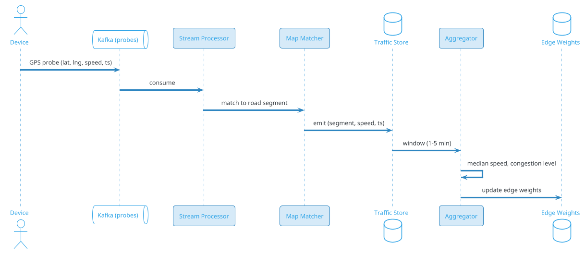
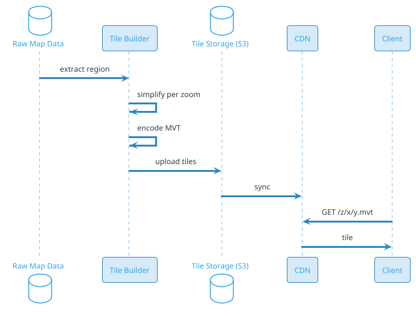
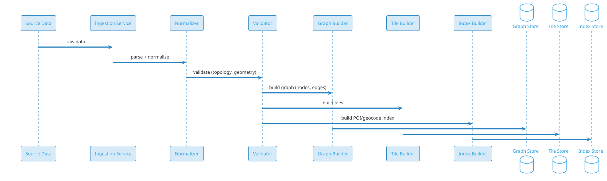
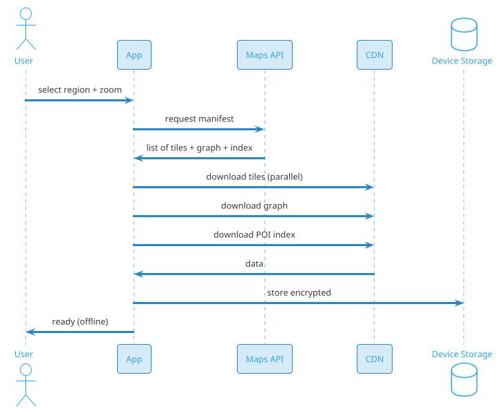

# Maps & Routing / Navigation (Google Maps)

## Problem Statement

Design a maps and routing service like Google Maps, Apple Maps, or Waze. The system ingests map data (roads, POIs, traffic), builds a routable graph, computes optimal routes between any two points (walking, driving, transit, cycling), serves vector tiles for map rendering, and integrates real-time traffic to update ETAs. It must handle billions of route requests per day with sub-second latency, work globally (including offline), and support turn-by-turn navigation, lane-level guidance, and live traffic.

**Example:**

```
Route request flow:

  1. User opens app at (lat=19.0760, lng=72.8777) — Mumbai
  2. Enters destination (lat=18.5204, lng=73.8567) — Pune
  3. App sends routing request:
     GET /route?origin=19.0760,72.8777
              &destination=18.5204,73.8567
              &mode=driving
              &departure_time=now
              &traffic=true
  4. Server:
     a. Snap origin/destination to nearest road nodes (map matching)
     b. Query routing graph (contraction hierarchies or A*)
     c. Incorporate real-time traffic (edge weights)
     d. Compute 3 alternatives
     e. Return polyline + steps + ETA + traffic conditions
  5. App renders route on map (vector tiles from CDN)
  6. Navigation begins
  7. En route: reroute on traffic change or deviation
  8. Arrive at destination

Map tile flow:

  1. App requests tile at zoom 15, x=25000, y=15000
  2. CDN edge serves cached vector tile (.mvt)
  3. App renders roads, labels, POIs from tile
  4. As user pans/zooms, new tiles fetched
  5. Pre-fetch adjacent tiles for smooth UX

Traffic ingestion:

  1. Millions of devices send GPS probes (anonymized)
  2. Stream processor matches probes to road segments
  3. Aggregate speeds per segment per time window
  4. Update traffic layer (edge weights)
  5. Router picks up new weights (near real-time)
  6. Live traffic displayed on map

Key challenges:
  - Planet-scale graph (billions of road segments)
  - Sub-second routing (contraction hierarchies, A*)
  - Real-time traffic (millions of GPS probes)
  - Map tile serving (CDN, vector tiles)
  - Map data freshness (updates from multiple sources)
  - Multi-modal routing (drive, walk, transit, cycle)
  - Turn-by-turn navigation (lane-level, voice)
  - Offline maps (downloadable regions)
  - ETA accuracy (ML models, historical patterns)
  - Geocoding (address → coordinates)
  - Reverse geocoding (coordinates → address)
  - Places / POI search
  - Map matching (GPS → road segment)
  - Global coverage (200+ countries)
  - Privacy (location data handling)

Scale:
  - 2B MAU
  - 1B route requests/day (~12K/sec avg, 100K/sec peak)
  - 10B map tile requests/day
  - 5B geocoding requests/day
  - 1B places searches/day
  - 500M GPS probes/day (traffic)
  - 100 PB map data (imagery + vector)
  - p99 route latency < 1 sec
  - p99 tile latency < 100 ms
  - 99.99% availability
```

**Real-world systems:** Google Maps, Apple Maps, Waze, HERE, TomTom, Mapbox, OpenStreetMap, Bing Maps, Baidu Maps, Amap.

**Why it's interesting:**

- **Graph algorithms at scale** — Dijkstra, A*, contraction hierarchies, ALT
- **Real-time traffic** — millions of GPS probes → edge weights
- **Map tiles** — vector vs raster, CDN delivery, pre-fetching
- **Map matching** — GPS → road segment (HMM, Viterbi)
- **Geocoding** — address parsing, normalization, indexing
- **Multi-modal** — driving, walking, transit, cycling
- **Turn-by-turn** — lane guidance, voice, re-routing
- **ETA prediction** — ML models, historical + real-time
- **Offline maps** — downloadable, local routing
- **Privacy** — location is sensitive; anonymization
- **Global scale** — 200+ countries, varied data quality
- **Data freshness** — new roads, closures, construction

---

## 1. Requirements Clarification

### Functional Requirements

- **Routing**: Point-to-point, multi-modal (drive, walk, transit, cycle)
- **Turn-by-turn navigation**: Voice guidance, lane-level
- **Alternatives**: Multiple routes
- **ETA**: Accurate prediction (traffic-aware)
- **Rerouting**: On deviation or traffic change
- **Map tiles**: Vector tiles for rendering
- **Geocoding**: Address → coordinates
- **Reverse geocoding**: Coordinates → address
- **Places search**: POIs (restaurants, gas, ATMs)
- **Traffic layer**: Live + historical
- **Street View**: 360° imagery (optional)
- **Offline maps**: Download region
- **Public transit**: Schedules, real-time
- **Ride-sharing integration**: Uber, Lyft pickup spots
- **Fuel-efficient routing**: Eco-friendly routes
- **EV routing**: Charging stations, range
- **Truck routing**: Height/weight restrictions

### Non-Functional Requirements

- **Scale**: 2B MAU, 1B routes/day, 10B tiles/day
- **Latency**: Route p99 < 1 sec; tile p99 < 100 ms
- **Availability**: 99.99%
- **Freshness**: Traffic updated every 1-5 min
- **Accuracy**: ETA within ±10% for 80% of trips
- **Global**: 200+ countries, all major roads
- **Offline**: Downloadable regions; local routing
- **Privacy**: Location anonymized; user consent
- **Compliance**: GDPR, CCPA, local laws

### Out of Scope

- Imagery capture (satellite, aerial) — separate pipeline
- 3D rendering / photorealistic (Google Earth)
- Autonomous driving (separate stack)
- Indoor maps (malls, airports)
- AR navigation (Live View)

---

## 2. Back-of-Envelope Estimation

### Traffic

```
Given:
  MAU                    = 2,000,000,000
  DAU                    = 500,000,000
  Route requests/day     = 1,000,000,000
  Tile requests/day      = 10,000,000,000
  Geocode requests/day   = 5,000,000,000
  Places searches/day    = 1,000,000,000
  GPS probes/day         = 500,000,000
  Peak multiplier        = 8x

Route QPS:
  Avg  = 1B / 86400 = ~11,574/sec
  Peak = ~92,593/sec

Tile QPS:
  Avg  = 10B / 86400 = ~115,741/sec
  Peak = ~925,926/sec

Geocode QPS:
  Avg  = 5B / 86400 = ~57,870/sec
  Peak = ~462,963/sec

Places QPS:
  Avg  = 1B / 86400 = ~11,574/sec
  Peak = ~92,593/sec

Traffic probes:
  Avg  = 500M / 86400 = ~5,787/sec
  Peak = ~46,296/sec
```

### Storage

```
Map data (routing graph):
  Roads: 100M km globally
  Segments (avg 50m each): 2B segments
  Per segment: ~200 bytes = ~400 GB
  With topology: ~2 TB
  With contraction hierarchies: ~5 TB

Map tiles (vector):
  Zoom levels 0-22
  Avg tile size: 50 KB (vector)
  Tiles at zoom 22: ~17T tiles (theoretical)
  Actually rendered: ~100B tiles
  Total: ~5 PB
  With raster (satellite): ~100 PB

POIs:
  200M places globally
  Per place: ~1 KB (name, address, category, hours, photos)
  Total: ~200 GB
  With indexes: ~1 TB

Geocoding index:
  Addresses: 500M
  Per address: ~500 bytes
  Total: ~250 GB
  With indexes: ~2 TB

Street View imagery:
  100B images x 1 MB = ~100 PB

Traffic history:
  Per road segment, per hour, per day
  2B segments x 24 hours x 365 days x 10 bytes = ~175 TB/year

Total: ~200 PB (dominated by imagery + tiles)
```

### Bandwidth

```
Tile delivery:
  10B tiles/day x 50 KB = 500 TB/day = ~5.8 GB/sec = 46 Gbps
  Peak: ~370 Gbps

Route responses:
  1B routes/day x 10 KB = 10 TB/day = ~116 MB/sec = ~1 Gbps
  Peak: ~8 Gbps

Geocode:
  5B/day x 1 KB = 5 TB/day = ~58 MB/sec

Traffic probes:
  500M/day x 500 B = 250 GB/day = ~2.9 MB/sec

Total peak: ~400 Gbps
```

### Latency Budget

```
Route request:

  Client → edge:                  ~10 ms
  Auth + rate limit:              ~2 ms
  Geocode (if address):           ~50 ms
  Map matching (snap to road):    ~10 ms
  Route computation (CH):         ~100-500 ms
  Traffic overlay:                ~20 ms
  Alternatives:                   ~100 ms
  Polyline + steps:               ~20 ms
  Total:                          ~300-700 ms

  Target p99 < 1 sec.

Tile request:

  Client → CDN edge:              ~10 ms
  Cache hit:                      ~1 ms
  Response:                       ~5 ms
  Total:                          ~20 ms

  Target p99 < 100 ms (CDN).

Turn-by-turn rerouting:

  Detect deviation:               ~500 ms
  Compute new route:              ~300 ms
  Update UI:                      ~200 ms
  Total:                          ~1 sec
```

---

## 3. High-Level Design

```d2
direction: down

user: User {shape: person}

cdn: "CDN (Vector Tiles)" {shape: cloud}
edge: "Edge PoP" {shape: cloud}

lb: "Load Balancer" {shape: hexagon}
api: "Maps API Gateway" {shape: hexagon}

route: "Routing Service" {shape: rectangle}
geocode: "Geocoding Service" {shape: rectangle}
places: "Places Service" {shape: rectangle}
tile: "Tile Service" {shape: rectangle}
traffic: "Traffic Service" {shape: rectangle}
eta: "ETA Service" {shape: rectangle}
match: "Map Matching Service" {shape: rectangle}
nav: "Navigation Service" {shape: rectangle}

graph: "Routing Graph (CH)" {shape: cylinder}
poi_db: "POI Database" {shape: cylinder}
geo_db: "Geocoding Index" {shape: cylinder}
tile_store: "Tile Storage" {shape: cylinder}
imagery: "Imagery (satellite)" {shape: cylinder}
traffic_db: "Traffic History" {shape: cylinder}
probe_stream: "Probe Stream (Kafka)" {shape: queue}

osm: "OpenStreetMap / Commercial Data" {shape: cloud}
updates: "Update Pipeline" {shape: rectangle}

user -> cdn
cdn -> edge
edge -> lb
lb -> api

api -> route
api -> geocode
api -> places
api -> tile
api -> traffic
api -> eta
api -> match
api -> nav

route -> graph
route -> traffic_db
route -> eta
geocode -> geo_db
places -> poi_db
tile -> tile_store
tile -> imagery
traffic -> probe_stream
traffic -> traffic_db
match -> graph
nav -> route
nav -> traffic

osm -> updates
updates -> graph
updates -> poi_db
updates -> geo_db
updates -> tile_store
```

### Component Responsibilities

| Component | Role |
|---|---|
| CDN / Edge | Cache + serve vector tiles |
| Load Balancer | Route to API fleet |
| Maps API Gateway | HTTP entry; auth; routing |
| Routing Service | Compute routes (CH, A*) |
| Geocoding Service | Address ↔ coordinates |
| Places Service | POI search |
| Tile Service | Serve map tiles |
| Traffic Service | Ingest probes; aggregate |
| ETA Service | Predict travel time |
| Map Matching Service | GPS → road segment |
| Navigation Service | Turn-by-turn, reroute |
| Routing Graph | CH-augmented road graph |
| POI Database | 200M places |
| Geocoding Index | 500M addresses |
| Tile Storage | Vector tiles |
| Imagery | Satellite/aerial |
| Traffic History | Historical speeds |
| Probe Stream | GPS probes (Kafka) |
| Update Pipeline | Ingest + process map updates |

### Why This Architecture

- **CDN for tiles** — massive read volume, static content
- **Separate services** — routing, geocoding, places scale independently
- **Contraction hierarchies** — fast routing at planet scale
- **Kafka for probes** — high-volume streaming
- **Traffic near real-time** — edge weights updated frequently
- **Graph in memory** — low-latency routing
- **POI/geocode in search engine** — fast lookups

---

## 4. Deep Dive: Routing Algorithms

### The Routing Problem

Given a graph `G = (V, E)` with edge weights (travel time), find the shortest path from `s` to `t`.

**Naive Dijkstra:** O(E log V) — too slow for 2B segments.

**Planet-scale requires preprocessing.**

### Dijkstra (Baseline)

```java
Map<Node, Long> dijkstra(Node source, Node target) {
    Map<Node, Long> dist = new HashMap<>();
    PriorityQueue<Node> pq = new PriorityQueue<>();
    dist.put(source, 0L);
    pq.add(source);
    while (!pq.isEmpty()) {
        Node u = pq.poll();
        if (u == target) break;
        for (Edge e : u.edges()) {
            long nd = dist.get(u) + e.weight();
            if (nd < dist.getOrDefault(e.to(), Long.MAX_VALUE)) {
                dist.put(e.to(), nd);
                pq.add(e.to());
            }
        }
    }
    return dist;
}
```

**Time:** Seconds for continent-scale. Too slow.

### A* (Heuristic)

Add heuristic `h(u)` = straight-line distance to target.

**Priority:** `f(u) = g(u) + h(u)`.

**Speedup:** 2-5x over Dijkstra.

### Bidirectional Search

Search from both source and target; meet in middle.

**Speedup:** ~2x.

### Contraction Hierarchies (CH)

**The standard for production routing.**

**Preprocessing (offline):**
1. Rank nodes by "importance" (edge difference, level)
2. Iteratively contract least-important node:
   - Remove node, add shortcuts for bypass paths
3. Build hierarchy: level 0 (least important) to level N (most)

**Query (online):**
1. **Bidirectional Dijkstra** on the hierarchy
2. Only relax edges to higher-level nodes
3. Meet in middle

**Speedup:** 100-1000x over Dijkstra.

**Preprocessing time:** Hours for planet.

**Memory:** ~2-3x original graph (shortcuts).

**Example:**

```
Original:
  A -- B -- C -- D
   \___________/

Contraction of B:
  Add shortcut A -- C (weight = A-B + B-C)
  Then contract B

Query A -> D:
  Only search upward (higher levels)
  Much fewer nodes explored
```

### Customizable Contraction Hierarchies (CCH)

**Separate topology from weights:**
- **Preprocessing (topology)**: Once, slow
- **Customization (weights)**: Fast (seconds)
- **Query**: Same speed as CH

**Benefit:** Update traffic weights without full rebuild.

### Multi-Level Dijkstra (MLD)

**Alternative to CH** (used by OSRM):
- **Partition graph** into cells
- **Precompute** intra-cell routes
- **Query** combines cells

**Trade-off:** Slightly slower query, faster preprocessing.

### Comparison

| Algorithm | Preprocessing | Query | Memory | Use |
|---|---|---|---|---|
| Dijkstra | None | Slow | Low | Baseline |
| A* | None | Medium | Low | Simple |
| Bidirectional | None | Medium | Low | Simple |
| **CH** | Hours | Fastest | 3x | Production |
| **CCH** | Hours + seconds | Fastest | 3x | Traffic updates |
| MLD | Minutes | Fast | 2x | OSRM |

**Recommendation:** CH for static graph; CCH for frequently updated weights (traffic).

### Multi-Modal Routing

Different profiles (car, walk, cycle, transit):
- **Separate graphs** per mode
- **Shared nodes** (transit stations)
- **Transfers** between modes

**Transit:** Time-dependent (schedules). Use **time-expanded graph** or **RAPTOR**.

### Time-Dependent Routing

**Traffic varies by time:**
- Edge weight = `f(time)` (historical + real-time)
- **Time-dependent CH:** Precompute per time bucket (e.g., hourly)
- **Query:** Use bucket matching departure time

**Simplification:** Use static CH; overlay real-time traffic as adjustment.

### Turn Restrictions

**No left turn, no U-turn:** Model as **edge-based graph** (nodes = turns).

**Implementation:**
- Node = (from_edge, to_node)
- Edge = valid turn
- Weight = turn cost + road cost

**Cost:** Graph ~2-3x larger.

### Alternatives

**Diversity:** Return 3 routes:
1. Fastest
2. Shortest distance
3. Scenic / avoid highways

**Method:**
- Penalize edges used in first route
- Recompute
- Repeat

**Plateau / via-node methods** for diversity.

### Route Response

```json
{
  "routes": [{
    "summary": "NH48 via Expressway",
    "distance_meters": 148000,
    "duration_seconds": 9000,
    "duration_in_traffic_seconds": 10800,
    "polyline": "encoded_polyline",
    "legs": [{
      "start_address": "Mumbai",
      "end_address": "Pune",
      "steps": [{
        "instruction": "Head southeast on ...",
        "distance_meters": 500,
        "duration_seconds": 30,
        "maneuver": "turn-right",
        "polyline": "..."
      }]
    }],
    "traffic_conditions": "moderate"
  }]
}
```

### Planet-Scale Graph

```
Road segments: 2B
Nodes: ~1B
Edges: ~4B (bidirectional)
CH shortcuts: ~10B
Total graph: ~15B edges
Memory: ~300 GB (compressed)
```

**Partitioned:** By region (continent, country) + border nodes.

**Query:** Load only relevant partitions.

---

## 5. Deep Dive: Real-Time Traffic

### Data Sources

- **GPS probes** from devices (anonymized)
- **Fleet vehicles** (Uber, Lyft, delivery)
- **Road sensors** (loop detectors)
- **Traffic cameras** (CV)
- **User reports** (Waze-style)
- **Government feeds** (511, DOT)
- **Historical patterns** (ML)

### GPS Probe Pipeline



### Map Matching

**Problem:** GPS is noisy; snap to actual road segment.

**Approach:** Hidden Markov Model (HMM) + Viterbi.

**Steps:**
1. **Candidate generation:** For each GPS point, find nearby road segments (within 50m).
2. **Emission probability:** P(GPS | segment) based on distance.
3. **Transition probability:** P(segment_j | segment_i) based on route feasibility.
4. **Viterbi:** Find most likely sequence of segments.

**Output:** Matched road segments + offsets.

### Traffic Aggregation

For each segment, aggregate probes in time window:
- **Median speed** (robust to outliers)
- **Free-flow speed** (from map data)
- **Congestion level:**
  - Free flow: > 80% of free-flow
  - Light: 60-80%
  - Moderate: 40-60%
  - Heavy: 20-40%
  - Standstill: < 20%

**Window:** 1-5 min for real-time; 15 min for smoothing.

### Traffic Prediction

**Real-time alone is not enough** — need to predict forward.

**Model:**
- **Inputs:** Current speeds, historical patterns, time of day, day of week, weather, events
- **Output:** Predicted speed for next 15-60 min
- **Algorithm:** Gradient boosted trees / LSTM

**Used for:** ETA, route selection.

### Traffic Update Cadence

- **1-5 min** for major roads
- **5-15 min** for minor roads
- **Real-time** for incidents (accidents, closures)

### Incident Detection

- **Sudden drop** in speed (from probes)
- **User reports** (Waze)
- **Authorities** (police, DOT feeds)
- **CV** on cameras

**Propagation:** Update routing graph immediately for affected edges.

### Historical Patterns

**Store:** Average speed per segment per (hour, day-of-week).

**Size:** 2B segments x 24 x 7 x ~10 bytes = ~3.4 TB.

**Use:** Predict baseline; compare real-time to detect anomalies.

### Traffic in Routing

**Two approaches:**

1. **Static CH + live adjustment:**
   - CH precomputed on free-flow
   - Live weights applied during query
   - Fast but suboptimal

2. **CCH with frequent customization:**
   - Topology precomputed
   - Weights customized every N min
   - Optimal but requires customization cycle

**Recommendation:** CCH with 5-min customization.

### Traffic Display

**Map layer:**
- Color-coded roads (green/yellow/red)
- Animated slow-downs
- Incident icons

**Tile updates:** Traffic overlay tile separate from base map.

### Privacy

**Anonymize probes:**
- Strip user ID
- Aggregate (k-anonymity, min 10 probes)
- Differential privacy for public stats
- Consent required

**GDPR:** Right to erasure; retention limits.

---

## 6. Deep Dive: Map Tiles

### Tile Concept

**Tiled map:** Split world into tiles at each zoom level.

**XYZ scheme:**
```
Zoom 0: 1 tile (whole world)
Zoom 1: 2x2 = 4 tiles
Zoom 2: 4x4 = 16 tiles
...
Zoom z: 2^z x 2^z tiles
```

**Tile coordinates:** (z, x, y) with y=0 at north.

**URL:**
```
https://tile.example.com/{z}/{x}/{y}.mvt
```

### Vector vs Raster Tiles

| Aspect | Vector | Raster |
|---|---|---|
| Format | Protobuf (MVT) | PNG/JPEG |
| Size | ~50 KB | ~100-200 KB |
| Client render | Yes (GPU) | No |
| Style | Dynamic (client) | Baked (server) |
| Zoom | Scalable | Fixed |
| Use | Modern maps | Legacy |

**Recommendation:** Vector tiles (Mapbox Vector Tile spec).

### Vector Tile Content

**Layers:**
- **roads**: geometry + attributes (type, name, one-way, speed limit)
- **buildings**: polygons
- **landuse**: parks, water, residential
- **labels**: place names, POIs
- **boundaries**: admin regions
- **transit**: routes, stops

**Format:** Protobuf with layers + features.

### Tile Generation

**Pipeline:**



**Simplification:** At lower zoom, fewer details (roads simplified, labels filtered).

### Zoom Levels

| Zoom | Scale | Content |
|---|---|---|
| 0-3 | Country | Country borders, major cities |
| 4-6 | State | States, major roads |
| 7-9 | City | Cities, highways |
| 10-12 | Neighborhood | Streets, POIs |
| 13-15 | Street | All roads, buildings |
| 16-18 | Building | Building outlines |
| 19-22 | Detail | Indoor, fine details |

### CDN Strategy

- **Cache**: 1-30 days (tiles rarely change)
- **Hit ratio**: > 95%
- **Pre-fetch**: Adjacent tiles when panning
- **Edge PoPs**: 500+ globally
- **Cost**: Dominated by CDN egress

### Tile Serving

**Static:** `GET /{z}/{x}/{y}.mvt` → CDN → S3.
**Dynamic:** On-demand tile generation (rare, for custom styles).

### Tile Pre-fetch

**Client behavior:**
- Fetch current viewport tiles
- Pre-fetch 1-2 zoom levels up/down
- Pre-fetch tiles in direction of pan
- Cache on device

**Benefit:** Smooth UX, fewer stalls.

### Offline Tiles

**Download region:**
1. User selects area
2. App fetches all tiles at chosen zooms
3. Stored on device
4. Routing graph also downloaded
5. Offline routing + display

**Size:** ~100 MB - 2 GB per region.

### Tile Updates

**When map data changes:**
- Regenerate affected tiles
- Push to CDN (invalidate + refresh)
- Version tiles (e.g., `?v=2026-09-19`)

**Incremental:** Only changed tiles re-rendered.

### Custom Styles

**Client-side:** Same vector tile, different style JSON.
- Google Maps style
- Satellite overlay
- Dark mode
- Custom (business)

**Benefit:** One tile set serves all styles.

### 3D Tiles

**For 3D buildings:** Additional tile format (Cesium 3D Tiles).
- Used in Google Earth, Apple Maps 3D
- Larger (10x) but richer

---

## 7. Deep Dive: Geocoding & Reverse Geocoding

### Geocoding (Address → Coordinates)

**Input:** "1600 Amphitheatre Parkway, Mountain View, CA"
**Output:** `(37.4220, -122.0841)`

**Steps:**
1. **Parse** address into components (number, street, city, state, zip)
2. **Normalize** (abbreviations, aliases)
3. **Match** against address index
4. **Rank** candidates (exact match, fuzzy, POI)
5. **Return** best + alternatives

### Address Index

**Data:** 500M addresses globally.

**Index:**
- **Inverted index**: tokens → addresses
- **Spatial index**: R-tree for proximity
- **Ranking**: BM25 + popularity + distance

**Storage:** Elasticsearch or custom.

### Address Parsing

**Challenges:**
- Different formats per country
- Abbreviations (St = Street, Ave = Avenue)
- Multiple languages
- Numeric ranges (100-199 Main St)
- Landmarks ("next to Starbucks")

**Approach:**
- **ML-based** parsing (sequence labeling)
- **Rule-based** for common cases
- **Country-specific** grammars

### Reverse Geocoding (Coordinates → Address)

**Input:** `(37.4220, -122.0841)`
**Output:** "1600 Amphitheatre Parkway, Mountain View, CA"

**Steps:**
1. Find nearby addresses (R-tree query)
2. Rank by distance + address precision
3. Return nearest (or nearest with house number)

**Fallback hierarchy:**
1. Exact address (with house number)
2. Street
3. Neighborhood
4. City
5. State
6. Country

### Geocoding at Scale

```
5B requests/day = ~58K/sec avg, ~463K/sec peak

Latency: p99 < 100 ms
```

**Implementation:**
- **Distributed Elasticsearch** (or custom)
- **Edge cache** for popular addresses
- **Prefetch** for navigation (addresses along route)

### POI Search (Places)

**Input:** "coffee near me", "gas station", "Starbucks"
**Output:** Ranked list of places with details

**Index:** 200M places, with categories, ratings, hours.

**Ranking factors:**
- **Relevance** (name match)
- **Distance** (proximity)
- **Popularity** (reviews, visits)
- **Rating** (stars)
- **Open now** (hours)
- **Personalization** (user history)

### Place Details

For each place:
- Name, address, phone
- Category, subcategory
- Hours, open now
- Rating, review count
- Photos
- Reviews
- Price level
- Accessibility

### Business Listings

**Verify ownership:**
- Business claims listing
- Updates info (hours, photos, menu)
- Responds to reviews

**Scale:** 200M listings; millions updated daily.

### Address Autocomplete

**As user types:**
- Prefix match on address index
- Rank by popularity + proximity
- Show top 5-10 suggestions
- Debounce (150 ms)
- Cache suggestions

### Geocoding API

```http
GET /geocode?address=...&region=...
GET /reverse-geocode?lat=...&lng=...
GET /places/search?query=...&location=...&radius=...
GET /places/{place_id}
GET /autocomplete?input=...&location=...
```

---

## 8. Deep Dive: Turn-by-Turn Navigation

### Navigation State Machine

```
IDLE → ROUTE_LOADED → NAVIGATING → REROUTING → ARRIVED
```

**Events:**
- User starts navigation
- User deviates from route
- Traffic changes significantly
- User reaches waypoint
- User arrives

### Step Generation

From route polyline + graph:
1. **Segment** route into steps (turn, continue, merge, exit)
2. **Generate instruction** per step (NLG)
3. **Attach maneuver** type (turn-left, turn-right, uturn, roundabout)
4. **Attach distance** to next maneuver
5. **Attach lane guidance** (if available)

### Voice Guidance

**Text-to-Speech (TTS):**
- Pre-recorded phrases (fast, natural)
- Dynamic TTS for names (street names, exits)

**Timing:**
- 1 km before: "In 1 kilometer, turn right"
- 300 m before: "Turn right in 300 meters"
- At turn: "Turn right"
- Post-turn: "Continue for 5 kilometers"

### Lane Guidance

**Lane-level data:**
- Lane count
- Allowed maneuvers per lane
- Lane geometry

**Display:**
- Visual diagram of lanes
- Highlight correct lane
- Voice: "Use the right two lanes"

**Data source:** Map data + CV from Street View imagery.

### Rerouting

**Triggers:**
- Deviation > 50 m from route
- Traffic change makes alternative faster
- User requests alternative
- Road closure on route

**Process:**
1. **Detect** trigger
2. **Recompute** route from current position
3. **Compare** to current (if faster, switch)
4. **Update** UI + voice
5. **Notify** user ("Faster route available")

**Latency:** < 1 sec for full reroute.

### GPS Tracking

**Client-side:**
- GPS updated 1 Hz
- Kalman filter to smooth
- Heading from GPS + compass + accelerometer
- Snap to road (map matching on client)

**Server-side:**
- Optional: send probes for traffic
- Rerouting requests
- ETA updates

### ETA Updates

**Continuously refine ETA:**
- Initial ETA from route
- Update as traffic changes
- Update as user deviates
- ML model for personalization (user's driving style)

**Display:** "Arrival at 10:45 AM" (time, not duration).

### Offline Navigation

**Downloaded region contains:**
- Map tiles
- Routing graph
- POI data

**Client-side routing:**
- Simplified CH (smaller, mobile-optimized)
- Local traffic history (no real-time)
- Voice guidance (TTS)

**Limitation:** No live traffic; static ETA.

### Safety

- **Voice-first** (eyes on road)
- **Large text** for glanceability
- **No distracting animations**
- **Hands-free** support (CarPlay, Android Auto)
- **Night mode**

---

## 9. Deep Dive: ETA Prediction

### Why ETA is Hard

- **Traffic varies** by time, day, weather, events
- **User behavior** varies (aggressive vs cautious)
- **Road conditions** (construction, accidents)
- **Short vs long trips** have different error profiles

### ETA Model

**Inputs:**
- Route edges + lengths
- Historical speeds (per edge, per time)
- Real-time speeds
- Time of day, day of week
- Weather
- Events (sports, concerts)
- User history (personalization)

**Output:** Predicted travel time (with confidence interval).

**Algorithm:**
- **Gradient boosted trees** (XGBoost, LightGBM)
- **LSTM** for sequential patterns
- **Ensemble** for robustness

### Per-Edge Prediction

Predict speed per edge, sum over route:
```
ETA = sum_e (length_e / speed_e)
```

**Model:** For each edge, predict speed given:
- Historical mean
- Current real-time
- Time context

### Route-Level Correction

**Problem:** Per-edge errors accumulate.

**Solution:** Route-level model that takes:
- Route features (length, turns, highways)
- Per-edge predictions
- User context

**Output:** Adjusted ETA.

### Personalization

**Learn user's driving style:**
- Compare actual vs predicted on past trips
- Adjust for user (fast/slow driver)
- Requires consent (privacy)

**Improvement:** ~10-15% accuracy.

### Confidence Interval

**Display:** "10:45 AM ± 5 min" (optional).
**Internal:** Use for routing (avoid uncertain paths).

**Model:** Quantile regression or ensemble spread.

### Accuracy Metrics

- **MAPE** (Mean Absolute Percentage Error)
- **Within ±10%**: 80%+ of trips
- **Within ±20%**: 95%+ of trips

### ETA in Routing

**Route selection uses ETA, not distance:**
- Fastest route (min ETA)
- Alternatives (slightly longer but more reliable)

**Trade-off:** Optimal ETA vs robust ETA.

### ETA for Transit

**Schedules + real-time:**
- Fixed schedule (timetable)
- Real-time vehicle positions
- Transfer time
- Walking time to/from stops

**Model:** Time-dependent graph.

---

## 10. Deep Dive: Map Data Pipeline

### Data Sources

| Source | Type | Coverage |
|---|---|---|
| **OpenStreetMap** | Community | Global, variable quality |
| **Commercial** (HERE, TomTom) | Licensed | Global, high quality |
| **Government** | Roads, admin | Per country |
| **Satellite imagery** | Visual | Global |
| **Street View** | 360° photos | Major roads |
| **User contributions** | Reports, edits | Local |
| **Fleet data** | Traces | Where fleets operate |
| **IoT sensors** | Real-time | Specific roads |

### Ingestion Pipeline



### Normalization

**Unify schemas** across sources:
- Common road type taxonomy
- Common attribute set (name, speed, one-way, toll)
- Common geometry (WGS84 coordinates)

### Validation

**Topology checks:**
- No dangling edges
- No duplicate nodes
- Connected graph (per region)

**Geometry checks:**
- Valid polygons (no self-intersection)
- Reasonable road curvature
- No overlaps

**Attribute checks:**
- Speed limits in valid range
- Names non-empty
- Direction consistent

### Graph Building

```
Road segments → nodes + edges
Intersections → nodes
Road attributes → edge weights
Turn restrictions → edge-based graph
Contraction hierarchies → precomputed shortcuts
```

### Map Updates

**Frequency:**
- **Major roads**: Weekly
- **Minor roads**: Monthly
- **POIs**: Daily
- **Traffic**: Real-time

**Incremental:** Only changed regions re-processed.

### Data Quality

**Confidence scores** per attribute:
- Source reliability
- Community verification
- Fleet validation

**Conflicts:** Prefer commercial > OSM > community.

### User Contributions

**Mechanisms:**
- **Report issue** (wrong road, closed)
- **Suggest edit** (add POI)
- **Photo upload** (verify)
- **Moderation** (community + staff)

**Feedback loop:** Verified edits → map updates.

### Street View Pipeline

1. **Capture:** Fleet vehicles with cameras
2. **Upload:** Terabytes/day to cloud
3. **Stitch:** Combine into panoramas
4. **Blur:** Faces, license plates (privacy)
5. **Geo-register:** Align to road
6. **Publish:** Serve via tiles

**Storage:** ~100 PB.

### Data Licensing

**Attribution:** Required for OSM, some commercial.
**Restrictions:** Can't resell some data.
**Compliance:** Per-source terms.

---

## 11. Deep Dive: Offline Maps

### Why Offline?

- **No connectivity** (subway, airplane, rural)
- **Data savings** (roaming)
- **Faster** (local access)
- **Privacy** (no live tracking)

### What to Download

- **Map tiles** (vector, at selected zooms)
- **Routing graph** (simplified CH)
- **POI data** (subset)
- **Geocode index** (subset)

### Size

| Region | Size |
|---|---|
| City | 50-200 MB |
| State | 500 MB - 2 GB |
| Country | 2-20 GB |
| Continent | 20-100 GB |

**Zooms:** Typically 8-16 (detail without indoor).

### Download Flow



### Client-Side Routing

**Simplified CH:**
- Smaller graph (fewer shortcuts)
- Mobile-optimized (low memory)
- Slower than server (still < 1 sec for regional routes)

**Trade-off:** Size vs speed.

### Offline Traffic

**Historical patterns** included:
- Average speeds per hour/day
- Congestion patterns

**No real-time** — best-effort ETA.

### Sync

**When online:**
- Update map data
- Sync user edits
- Download new POIs

**Conflict resolution:** Server wins.

### Storage Management

- **Quota**: User-configurable (e.g., 5 GB)
- **Eviction**: LRU for rarely-used regions
- **Expiration**: Re-download after N days (map updates)

### Security

- **Encrypted at rest** (device key)
- **Signed tiles** (prevent tampering)
- **No PII in stored data**

---

## 12. Scaling Considerations

### Read Scaling

- **CDN** for tiles (500+ PoPs)
- **Edge cache** for popular routes/geocodes
- **Read replicas** for POI/geocode
- **In-memory graph** for routing
- **Cache** traffic data

### Write Scaling

- **Kafka** for probes (partitioned by region)
- **Stream processing** for traffic aggregation
- **Batch** for map updates
- **CDN** for tile distribution

### Sharding

- **Routing graph**: Partition by region (country/state)
- **POI index**: Shard by geohash
- **Geocode index**: Shard by country
- **Traffic**: Partition by region
- **Tiles**: Sharded by z/x/y

### Multi-Region

```d2
direction: down

us: "US Region" {
  shape: cloud
}
eu: "EU Region" {
  shape: cloud
}
apac: "APAC Region" {
  shape: cloud
}

us_graph: "US Graph" {
  shape: cylinder
}
eu_graph: "EU Graph" {
  shape: cylinder
}
apac_graph: "APAC Graph" {
  shape: cylinder
}

us -> us_graph
eu -> eu_graph
apac -> apac_graph
```

**Strategy:**
- **Regional graph** (load only relevant)
- **Global tiles** (CDN)
- **Regional POI/geocode** (latency + residency)
- **Cross-region routing** (via border nodes)

### Cross-Region Routing

**Intercontinental:** Route spans regions.
- **Via border nodes** (predefined)
- **Concatenate** regional routes
- **Global graph** for long routes (simplified)

### Peak Handling

- **Auto-scale** API
- **CDN** absorbs tile spikes
- **Cache** popular routes
- **Pre-compute** for known events (sports, concerts)
- **Rate limit** per user

### Cost Optimization

| Component | Optimization |
|---|---|
| CDN | Cache aggressively; negotiate rates |
| Compute | Reserved + spot for batch |
| Storage | Tiered (hot tiles, cold imagery) |
| Traffic probes | Sample (1%) |
| Geocode | Cache popular |
| Graph | Compressed in-memory |

### Capacity Planning

```
Route QPS: 100K/sec peak
Per routing server: 500 routes/sec (CH)
→ 200 servers peak
→ 100 sustained

Tile QPS: 1M/sec peak
CDN absorbs (99% hit ratio)
Origin: ~10K/sec

Geocode QPS: 463K/sec peak
Per server: 5K/sec
→ 100 servers peak

Traffic probes: 46K/sec peak
Kafka + stream processor
```

---

## 13. Bottlenecks and Trade-offs

| Concern | Solution | Trade-off |
|---|---|---|
| Routing speed | CH + CCH | Preprocessing time/memory |
| Traffic freshness | Streaming + frequent customization | CPU cost |
| Map updates | Incremental | Complexity |
| Tile delivery | CDN + vector tiles | Client complexity |
| Offline | Downloadable + local CH | Storage |
| ETA accuracy | ML + personalization | Complexity, privacy |
| Geocoding | Distributed search | Latency |
| Multi-modal | Separate graphs | Storage |
| Turn-by-turn | Step generation + TTS | Data quality |
| Privacy | Anonymization | Less personalization |

### Design Decisions Summary

| Decision | Choice | Rationale |
|---|---|---|
| Routing | CH (static) + CCH (traffic) | Fast + fresh |
| Graph | Partitioned by region | Scale |
| Traffic | Kafka + stream + aggregation | Real-time |
| Tiles | Vector (MVT) + CDN | Flexible + scalable |
| Geocoding | Elasticsearch + R-tree | Fast lookups |
| ETA | ML (gradient boosted + LSTM) | Accuracy |
| Navigation | Client-side + server-assisted | Responsive |
| Offline | Local CH + tiles | UX |
| Multi-modal | Separate graphs | Correctness |
| Privacy | Anonymize + aggregate | Compliance |

---

## 14. Failure Scenarios

### Routing Service Down

**Impact:** Can't compute new routes.

**Mitigation:**
- Multi-region; failover
- Client-side cache
- Alert ops (P0)
- Graceful degradation (show last route)

### Graph Store Down

**Impact:** Routing unavailable.

**Mitigation:**
- In-memory replicas
- Multi-AZ
- Alert ops (P0)

### CDN Outage

**Impact:** Tiles unavailable.

**Mitigation:**
- Multi-CDN
- Fallback to origin
- Offline cache on device
- Alert ops (P0)

### Traffic Stream Down

**Impact:** ETA stale; no live traffic.

**Mitigation:**
- Historical patterns as fallback
- Buffer in Kafka
- Alert ops (P1)

### Geocoding Down

**Impact:** Address search fails.

**Mitigation:**
- Cache popular
- Fallback to reverse geocode
- Alert ops (P1)

### GPS Probes Stop

**Impact:** Traffic degrades.

**Mitigation:**
- Historical patterns
- Fleet data
- Alert ops (P1)

### Map Data Bug

**Impact:** Wrong routes (e.g., through building).

**Mitigation:**
- Validation pipeline
- User reports
- Rollback map version
- Alert ops

### ETA Model Drift

**Impact:** Inaccurate ETAs.

**Mitigation:**
- Continuous evaluation
- Retrain frequently
- A/B testing
- Alert on MAPE increase

### Incident on Route

**Impact:** User stuck.

**Mitigation:**
- Reroute automatically
- Notify user
- Update traffic immediately

### DDoS on API

**Impact:** Service unavailable.

**Mitigation:**
- CDN / WAF
- Rate limiting
- Auto-scale
- Alert ops

### Location Privacy Breach

**Impact:** User location exposed.

**Mitigation:**
- Anonymization
- Differential privacy
- Consent
- Audit

### Region Outage

**Impact:** Maps unavailable in region.

**Mitigation:**
- Multi-region
- DNS failover
- Alert ops (P0)

### Storage Overflow

**Impact:** Can't store new data.

**Mitigation:**
- Lifecycle policies
- Tiered storage
- Compression
- Alert ops

### Routing Bug (Infinite Loop)

**Impact:** Routing hangs.

**Mitigation:**
- Timeout (5 sec)
- Fallback (straight-line)
- Alert ops
- Post-mortem

### Offline Data Corruption

**Impact:** Bad routes offline.

**Mitigation:**
- Checksums
- Re-download
- Alert user

### Turn Restriction Missing

**Impact:** Illegal route.

**Mitigation:**
- Data validation
- User reports
- Frequent updates

---

## 15. Monitoring and Alerts

### Key Metrics

| Metric | Target | Alert Threshold |
|---|---|---|
| Route p99 | < 1 sec | > 3 sec |
| Tile p99 | < 100 ms | > 500 ms |
| Geocode p99 | < 100 ms | > 500 ms |
| Routing success rate | > 99.9% | < 99% |
| ETA accuracy (MAPE) | < 10% | > 20% |
| Traffic freshness | < 5 min | > 15 min |
| CDN hit ratio | > 95% | < 85% |
| Graph build success | > 99% | < 95% |
| Probe ingestion rate | baseline | drop > 20% |
| Routing alternatives | 3 | < 2 |
| Offline coverage | > 90% | < 70% |
| Reroute p99 | < 1 sec | > 3 sec |

### Dashboards

- **Global**: Route QPS, tile QPS, latency
- **Per-region**: Latency, error rate
- **Routing**: Algo, graph size, memory
- **Traffic**: Probe rate, freshness, incidents
- **Tiles**: Cache hit, bandwidth, per-zoom
- **Geocoding**: QPS, accuracy, latency
- **ETA**: MAPE, confidence interval coverage
- **CDN**: Hit ratio, egress, per-PoP
- **Business**: DAU, routes/user, session length

### Alerts

- **P0**: Routing down, CDN down, region outage
- **P1**: p99 > 3 sec, ETA MAPE > 20%, traffic stale
- **P2**: Cache hit < 85%, probe rate drop
- **P3**: Graph build failure, tile error rate high
- **P4**: Cost anomaly, unusual traffic pattern

### Business KPIs

- **DAU/MAU**
- **Routes/user/day**
- **Session length**
- **Search → navigation conversion**
- **ETA accuracy**
- **User retention**
- **NPS**

---

## 16. Cost Estimation

Rough monthly cost (AWS) for 2B MAU:

| Component | Spec | Cost/month |
|---|---|---|
| API servers | 500 x c6g.2xlarge | ~$120,000 |
| Routing servers | 200 x r6g.4xlarge (in-memory) | ~$400,000 |
| Geocoding | 100 x r6g.2xlarge | ~$60,000 |
| POI servers | 50 x c6g.2xlarge | ~$24,000 |
| Tile origin servers | 100 x c6g.2xlarge | ~$48,000 |
| Traffic processing | 200 x c6g.2xlarge | ~$96,000 |
| ETA / ML | 50 x g4dn.xlarge | ~$30,000 |
| Kafka (MSK) | 50 brokers | ~$25,000 |
| PostgreSQL (metadata) | 20 shards x db.r6g.2xlarge | ~$46,000 |
| Redis | 50 x cache.r6g.2xlarge | ~$50,000 |
| S3 (tiles) | 5 PB | ~$115,000 |
| S3 (imagery) | 100 PB | ~$2,300,000 |
| S3 (traffic history) | 200 TB | ~$5,000 |
| **CDN egress** | 500 TB/day | **~$6,000,000** |
| Monitoring | Datadog | ~$100,000 |
| **Total** | | **~$9.4M/month** |

**Per user:** ~$0.005/month.
**Per route:** ~$0.0001 (0.1 millidollar).

**Cost optimization:**

- **CDN negotiation**: Multi-CDN, reserved
- **Tile compression**: Vector tiles 50% smaller
- **Cache hit > 95%**: Fewer origin fetches
- **Spot for batch**: Graph build, analytics
- **Regional routing**: Avoid cross-region
- **Sample probes**: 1% sample for traffic

**Reality:** CDN egress + imagery dominate. Maps is capital-intensive.

---

## 17. Extensions and Follow-ups

### Street View

- 360° panoramic imagery
- Capture fleet + processing
- Blur PII (faces, plates)
- Geo-registration
- Navigate between images

### Live View (AR)

- Camera + GPS + compass
- Overlay directions on real world
- Landmark recognition
- Used for walking navigation

### Indoor Maps

- Floor plans (malls, airports)
- Wi-Fi / beacon positioning
- Step-by-step indoor routing

### 3D Maps

- Building models (photogrammetry)
- Terrain
- 3D routing (bridges, tunnels)
- Used in Google Earth, Apple Maps 3D

### Autonomous Vehicle Maps

- HD maps (cm-level precision)
- Lane-level detail
- Traffic sign / signal positions
- Sensor-ready (LiDAR reference)

### Electric Vehicle Routing

- Charging station locations
- Range estimation (battery, terrain, weather)
- Charge time optimization
- Route via chargers

### Truck Routing

- Height / weight / hazmat restrictions
- Bridge limits
- Truck-legal roads
- Rest stops

### Fuel-Efficient Routing

- Minimize fuel consumption
- Terrain, speed, acceleration
- Eco-routing option

### Multi-Stop Routing

- Traveling salesman (TSP) variant
- Time windows (VRPTW)
- Used for deliveries

### Ride-Sharing Integration

- Pickup/dropoff spots
- Surge pricing zones
- Driver-passenger matching
- ETA for both

### Public Transit

- Schedules + real-time
- Transfers
- Multi-modal (walk + transit)
- Fare calculation

### Traffic Predictions

- ML models (LSTM, GNN)
- Event-aware (sports, concerts)
- Weather-aware
- Incident forecasting

### Privacy-Enhancing Tech

- Differential privacy for traffic
- Federated learning for ETA
- On-device map matching
- Consent-based personalization

### Green Navigation

- Carbon emissions estimate
- Eco-routes
- EV charger integration
- Carpool lanes

### Accessibility

- Wheelchair-accessible routes
- Elevator locations (indoor)
- Audio instructions
- Large text / high contrast

### Localization

- 200+ languages
- Local units (miles vs km)
- Local conventions (roundabout vs traffic circle)
- Voice accents

### Real-Time Collaboration

- Share live location
- "Find my friends"
- Group navigation
- Family tracking

### Web3

- Decentralized maps (Hivemapper)
- Token incentives for data
- Blockchain-based POIs

### AI Assistants

- Voice-first navigation
- Conversational queries ("find coffee on the way")
- Contextual suggestions

---

## 18. Summary

| Aspect | Decision |
|---|---|
| Routing | Contraction Hierarchies + CCH for traffic |
| Graph | Partitioned by region; in-memory |
| Traffic | Kafka probes + stream aggregation |
| Tiles | Vector (MVT) + CDN (500+ PoPs) |
| Geocoding | Elasticsearch + R-tree |
| POI | Elasticsearch + popularity ranking |
| ETA | Gradient boosted + LSTM + personalization |
| Map matching | HMM + Viterbi |
| Navigation | Client-side + server-assisted |
| Offline | Local CH + tiles + POI subset |
| Multi-modal | Separate graphs per mode |
| Data pipeline | Ingest → normalize → validate → build |
| Privacy | Anonymize + aggregate + consent |
| Scale | 2B MAU, 1B routes/day, 10B tiles/day |
| Latency | Route p99 < 1 sec; tile p99 < 100 ms |
| Availability | 99.99% |
| Cost | ~$9.4M/month (CDN + imagery dominate) |

**Key takeaways:**

- **Contraction Hierarchies** is the production standard for planet-scale routing — 100-1000x speedup
- **Customizable CH** separates topology from weights, enabling frequent traffic updates
- **Real-time traffic** comes from GPS probes → map matching → aggregation → edge weights
- **Vector tiles** (MVT) are the modern standard — one tile set, many styles
- **CDN is essential** for tiles — 95%+ hit ratio, 500+ PoPs
- **Map matching** (HMM + Viterbi) converts noisy GPS to precise road segments
- **ETA prediction** uses ML (gradient boosted + LSTM) with personalization
- **Geocoding** needs distributed search (Elasticsearch) + spatial index (R-tree)
- **Offline maps** combine downloadable tiles + local CH graph
- **Multi-modal** routing uses separate graphs per mode
- **Privacy** (anonymization, differential privacy) is critical for location data
- **Data pipeline** normalizes multiple sources (OSM, commercial, government)
- **Costs** are dominated by CDN egress + imagery storage
- **Latency** targets are tight: routes < 1 sec, tiles < 100 ms
- **Global scale** requires regional partitioning + cross-border routing

### Similar Pattern Problems

- Proximity Service (Yelp — location search)
- Ride Booking (Uber — routing + matching)
- Food Delivery (DoorDash — routing + ETA)
- Distributed Cache (tile caching)
- CDN (design your own CDN)
- Recommendation Engine (personalized POIs)
- Search Autocomplete (address autocomplete)
- Video Streaming (imagery delivery)
- Metrics / Monitoring (real-time traffic)
- Distributed Tracing (route tracing)