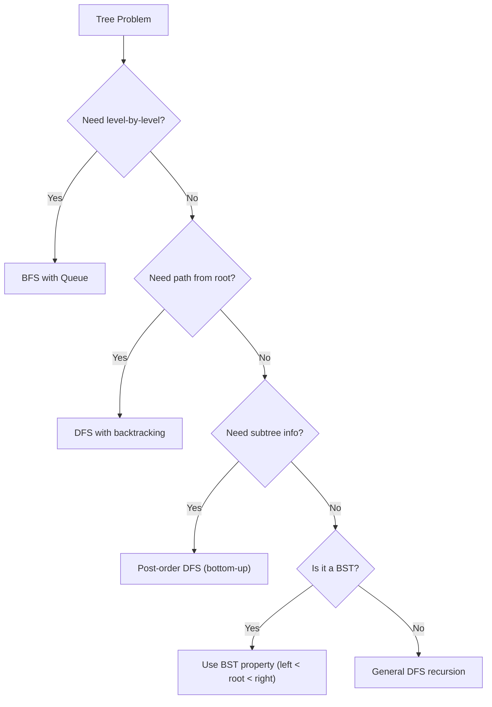
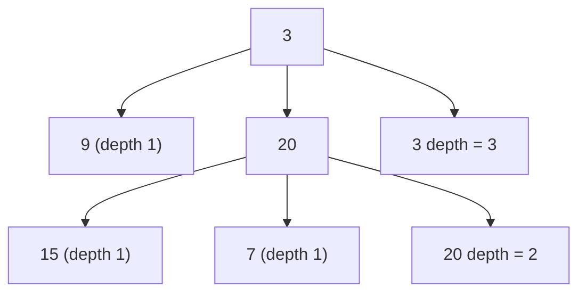
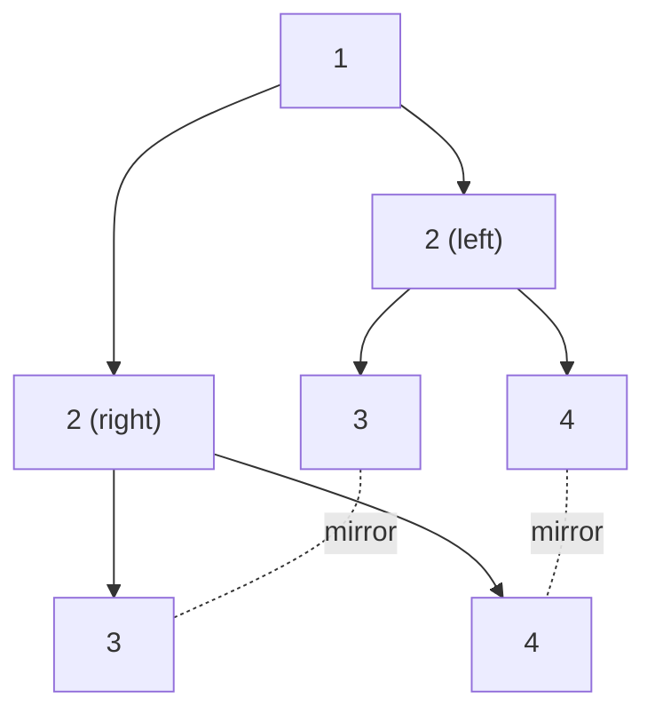
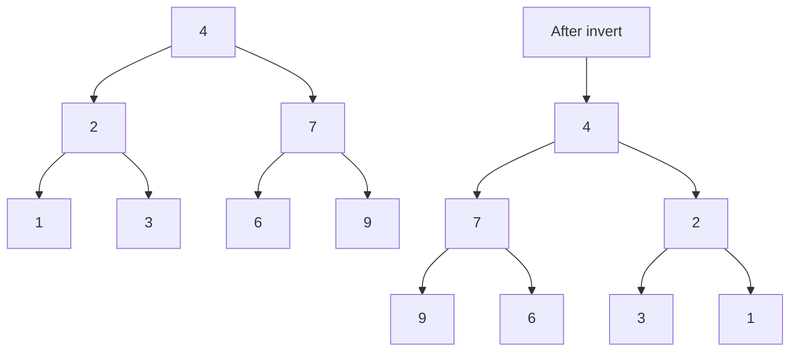
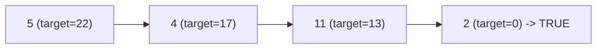
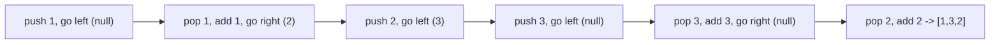
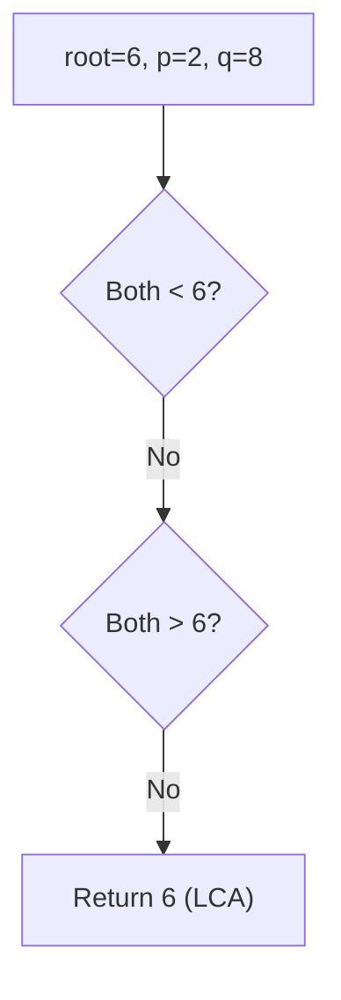
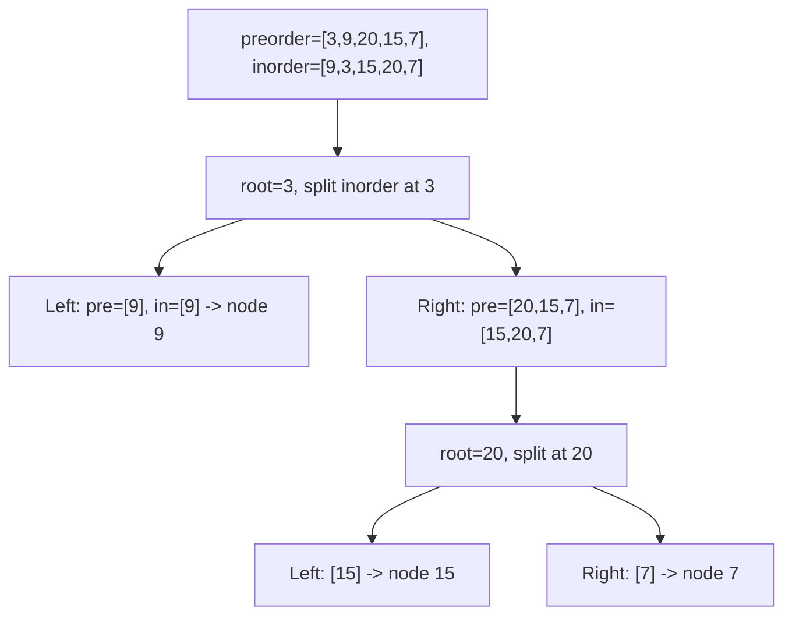
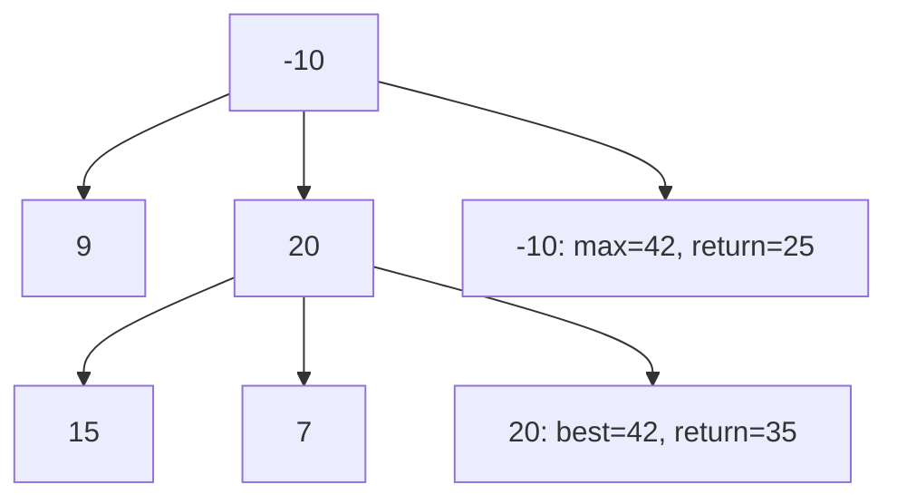
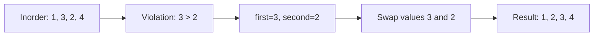

# Tree

## What is a Tree? (Simple Explanation)
Imagine a family tree: one ancestor at the top, their children below them, and their grandchildren below that. That's a **tree** structure!

In computer science, a tree is a hierarchical data structure where:
- One node is the **root** (top)
- Each node can have **children** (nodes below it)
- A node with no children is a **leaf**
- Nodes are connected by **edges** (links)

**Real-life analogies:**
- Family tree (ancestors and descendants)
- Company org chart (CEO at top, employees below)
- File system (folders containing files and subfolders)
- HTML DOM structure (nested elements)

## Key Concepts (In Simple Terms)
- **Node**: A single element containing data and links to children
- **Root**: The topmost node (no parent)
- **Leaf**: A node with no children
- **Parent/Child**: Direct relationship (parent is above, child is below)
- **Siblings**: Nodes with the same parent
- **Height**: Longest path from root to a leaf
- **Depth**: Distance from root to a node
- **Subtree**: A node and all its descendants
- **Binary Tree**: Each node has at most 2 children (left and right)
- **BST (Binary Search Tree)**: Left child < Parent < Right child
- **Balanced Tree**: Height difference between subtrees ≤ 1 (AVL, Red-Black)

## Tree vs Binary Tree vs BST
| Type | Rule | Example |
|------|------|---------|
| Tree | Each node has any number of children | General hierarchy |
| Binary Tree | Each node has at most 2 children | Expression trees |
| BST | Left < Parent < Right | Sorted data, search |

## Common Problems
- Tree Traversals (all types)
- Maximum/Minimum Depth
- Symmetric Tree
- Path Sum problems
- Lowest Common Ancestor (LCA)
- Build Tree from Traversals
- Binary Tree Maximum Path Sum
- Recover BST

## Patterns / Techniques
- **Recursion**: Most tree problems are naturally recursive
- **DFS (Depth-First Search)**: Go deep before wide
- **BFS (Breadth-First Search)**: Go level by level
- **Divide and Conquer**: Solve left, solve right, combine
- **Backtracking**: For path-related problems

## Complexity
| Operation | Balanced BST | Skewed BST |
|-----------|--------------|------------|
| Search | O(log n) | O(n) |
| Insert | O(log n) | O(n) |
| Delete | O(log n) | O(n) |
| Space (recursion) | O(log n) | O(n) |

## Tree Traversals (The 4 Ways)
| Traversal | Order | Use Case |
|-----------|-------|----------|
| **Inorder** | Left → Root → Right | BST gives sorted order |
| **Preorder** | Root → Left → Right | Copy/serialize tree |
| **Postorder** | Left → Right → Root | Delete tree, evaluate expressions |
| **Level Order** | Level by level (BFS) | Shortest path, level processing |

**Memory trick:** The name tells you when the root is visited:
- **Pre**order: root **pre** (before)
- **In**order: root **in** between
- **Post**order: root **post** (after)

---

## 🔹 Basic Templates

### TreeNode Definition
```java
class TreeNode {
    int val;
    TreeNode left;
    TreeNode right;
    TreeNode(int val) {
        this.val = val;
    }
}
```

### Recursive DFS Template
```java
public int dfs(TreeNode root) {
    if (root == null) return 0;
    int left = dfs(root.left);
    int right = dfs(root.right);
    return 1 + Math.max(left, right);
}
```

### BFS (Level Order) Template
```java
public List<List<Integer>> levelOrder(TreeNode root) {
    List<List<Integer>> result = new ArrayList<>();
    if (root == null) return result;
    Queue<TreeNode> queue = new LinkedList<>();
    queue.offer(root);
    while (!queue.isEmpty()) {
        int size = queue.size();
        List<Integer> level = new ArrayList<>();
        for (int i = 0; i < size; i++) {
            TreeNode node = queue.poll();
            level.add(node.val);
            if (node.left != null) queue.offer(node.left);
            if (node.right != null) queue.offer(node.right);
        }
        result.add(level);
    }
    return result;
}
```

### Inorder Traversal Template
```java
// Recursive
public void inorder(TreeNode root, List<Integer> result) {
    if (root == null) return;
    inorder(root.left, result);
    result.add(root.val);
    inorder(root.right, result);
}
```

### Tree Decision Flow


---

## 🔹 Practice Problems by Topic

### Easy

#### 1. **Maximum Depth of Binary Tree**

**Problem Description:**
Given the root of a binary tree, return its maximum depth (number of nodes along the longest path from root to a leaf).

**Simple Analogy:**
Like measuring how tall a family tree is — the longest chain from the top ancestor to the deepest descendant.

**Example Walkthrough:**

Input:
```
    3
   / \
  9  20
     / \
    15  7
```
```
Expected Output: 3

Paths:
3 -> 9 (depth 2)
3 -> 20 -> 15 (depth 3)
3 -> 20 -> 7 (depth 3)

Max depth = 3

Step-by-step:
root=3:
  left=9: depth=1
  right=20:
    left=15: depth=1
    right=7: depth=1
    max(1,1)+1 = 2
  max(1,2)+1 = 3
Return 3
```

Input:
```
    1
   /
  2
 /
3
```
```
Expected Output: 3 (skewed tree)
```

Input: `root = null`
```
Expected Output: 0
```

Input: `root = [1]`
```
Expected Output: 1
```

**Key Insight - Recursive Max + 1:**
The depth of a tree = 1 (for the root) + max(depth of left subtree, depth of right subtree). Base case: null has depth 0.

**Why It Works:**
- Every path goes through the root
- Longest path = 1 + longer of (left subtree's longest path, right subtree's longest path)
- This is divide and conquer
- Recursion naturally handles all subtrees

**Visualization - Max Depth:**


```java
public int maxDepth(TreeNode root) {
    if (root == null) return 0;
    return 1 + Math.max(maxDepth(root.left), maxDepth(root.right));
}
```

**Edge Cases:**
- Empty tree: returns 0
- Single node: returns 1
- Skewed tree (all left or all right): returns n
- Balanced tree: returns log n + 1

**Time Complexity**: O(n) — visit every node once
**Space Complexity**: O(h) — recursion stack

**Similar Pattern Problems:**
- Minimum Depth of Binary Tree
- Tree Height
- Balanced Binary Tree

---

#### 2. **Symmetric Tree (Mirror Tree)**

**Problem Description:**
Given the root of a binary tree, check whether it is a mirror of itself (symmetric around its center).

**Simple Analogy:**
Like checking if a tree looks the same in a mirror. The left subtree should mirror the right subtree.

**Example Walkthrough:**

Input:
```
    1
   / \
  2   2
 / \ / \
3  4 4  3
```
```
Expected Output: true

Check mirror:
1.left (2) vs 1.right (2): equal
2.left (3) vs 2.right (3): equal
2.right (4) vs 2.left (4): equal
3.left (null) vs 3.right (null): equal
... all match -> true
```

Input:
```
    1
   / \
  2   2
   \   \
   3    3
```
```
Expected Output: false

2.right (3) vs 2.right (3): But for mirror, we compare:
2.right (3) vs 2.left (null): not equal -> false
```

Input: `root = [1]`
```
Expected Output: true (single node is symmetric)
```

Input: `root = null`
```
Expected Output: true (empty is symmetric)
```

**Key Insight - Mirror Comparison:**
Two trees are mirrors if:
- Their root values are equal
- Left subtree of first is mirror of right subtree of second
- Right subtree of first is mirror of left subtree of second

**Why It Works:**
- Symmetry means left side mirrors right side
- Compare outer pairs (left.left vs right.right)
- Compare inner pairs (left.right vs right.left)
- Recursion handles all levels

**Visualization - Symmetric Tree:**


```java
public boolean isSymmetric(TreeNode root) {
    if (root == null) return true;
    return isMirror(root.left, root.right);
}

private boolean isMirror(TreeNode left, TreeNode right) {
    if (left == null && right == null) return true;
    if (left == null || right == null) return false;
    return left.val == right.val
        && isMirror(left.left, right.right)
        && isMirror(left.right, right.left);
}
```

**Edge Cases:**
- Empty tree: returns true
- Single node: returns true
- Two nodes different: returns false
- Perfect mirror: returns true

**Time Complexity**: O(n)
**Space Complexity**: O(h)

**Similar Pattern Problems:**
- Same Tree
- Is Subtree
- Flip Equivalent Binary Trees

---

#### 3. **Invert Binary Tree**

**Problem Description:**
Given the root of a binary tree, invert it (swap left and right children everywhere) and return its root.

**Simple Analogy:**
Like looking at a tree in a mirror — left becomes right, right becomes left, recursively.

**Example Walkthrough:**

Input:
```
    4
   / \
  2   7
 / \ / \
1  3 6  9
```
```
Expected Output:
    4
   / \
  7   2
 / \ / \
9  6 3  1

Step-by-step:
root=4: swap left(2) and right(7)
  subtree 2: swap 1 and 3
  subtree 7: swap 6 and 9
Result: 4 with children 7, 2; 7 has 9, 6; 2 has 3, 1
```

Input:
```
    2
   / \
  1   3
```
```
Expected Output:
    2
   / \
  3   1
```

Input: `root = null`
```
Expected Output: null
```

**Key Insight - Swap and Recurse:**
For each node, swap its left and right children. Then recursively invert both subtrees.

**Why It Works:**
- Inverting means every left-right relationship is reversed
- Swapping at each node flips the immediate children
- Recursing ensures all descendants are also flipped
- Base case: null node returns null

**Visualization - Invert Tree:**


```java
public TreeNode invertTree(TreeNode root) {
    if (root == null) return null;
    TreeNode temp = root.left;
    root.left = invertTree(root.right);
    root.right = invertTree(temp);
    return root;
}
```

**Edge Cases:**
- Empty tree: returns null
- Single node: returns it unchanged
- Skewed tree: inverts to opposite skew
- Complete tree: fully mirrored

**Time Complexity**: O(n)
**Space Complexity**: O(h)

**Similar Pattern Problems:**
- Flip Tree
- Mirror Tree Operations
- Symmetric Tree

---

#### 4. **Path Sum**

**Problem Description:**
Given the root of a binary tree and an integer targetSum, return true if there's a root-to-leaf path whose values sum to targetSum.

**Simple Analogy:**
Like finding a route from the root to a leaf where the total distance equals a target.

**Example Walkthrough:**

Input:
```
    5
   / \
  4   8
 /   / \
11  13  4
/ \      \
7  2      1
```
`targetSum = 22`
```
Expected Output: true

Path: 5 -> 4 -> 11 -> 2
Sum: 5 + 4 + 11 + 2 = 22

Step-by-step:
root=5, target=22
  left=4, target=17
    left=11, target=13
      left=7, target=6 -> leaf, 7 != 6 -> false
      right=2, target=11 -> leaf, 2 != 11? Wait...
      Actually 2 != 11, but 5+4+11+2=22, so target should be 0 at leaf.
      Let me redo: target=22
      5: target=17
      4: target=13
      11: target=2
      2: target=0 -> leaf! 2-2=0 -> true
  Return true
```

Input: `root = [1,2,3]`, `targetSum = 5`
```
Expected Output: false

Paths: 1+2=3, 1+3=4
Neither = 5
```

Input: `root = []`, `targetSum = 0`
```
Expected Output: false (no path)
```

Input: `root = [5]`, `targetSum = 5`
```
Expected Output: true (single node, 5=5)
```

**Key Insight - Subtract at Each Step:**
At each node, subtract its value from targetSum. At a leaf, check if remaining target is 0. Recurse on both children.

**Why It Works:**
- A root-to-leaf path sum can be checked by subtracting as we go
- At a leaf, if remaining sum is 0, path sum equals original target
- Recurse on both children (OR relationship)
- Base case: null returns false

**Visualization - Path Sum:**


```java
public boolean hasPathSum(TreeNode root, int targetSum) {
    if (root == null) return false;
    if (root.left == null && root.right == null) {
        return targetSum == root.val;
    }
    return hasPathSum(root.left, targetSum - root.val)
        || hasPathSum(root.right, targetSum - root.val);
}
```

**Edge Cases:**
- Empty tree: returns false
- Single node matching target: returns true
- Single node not matching: returns false
- Negative values: handled correctly

**Time Complexity**: O(n)
**Space Complexity**: O(h)

**Similar Pattern Problems:**
- Path Sum II (return all paths)
- Path Sum III (any path)
- Path Sum IV (depth sum)

---

### Medium

#### 5. **Binary Tree Inorder Traversal (Iterative)**

**Problem Description:**
Given the root of a binary tree, return its inorder traversal (Left → Root → Right) iteratively (without recursion).

**Simple Analogy:**
Like reading a BST in sorted order using a stack instead of recursion.

**Example Walkthrough:**

Input:
```
    1
     \
      2
     /
    3
```
```
Expected Output: [1, 3, 2]

Inorder: left (none), root (1), right (2 with left 3)
= 1, 3, 2

Iterative:
curr=1: push 1, go left (null)
pop 1, add 1, go right (2)
curr=2: push 2, go left (3)
curr=3: push 3, go left (null)
pop 3, add 3, go right (null)
pop 2, add 2, go right (null)
Result: [1, 3, 2]
```

Input:
```
    1
   / \
  2   3
```
```
Expected Output: [2, 1, 3]
```

Input: `root = null`
```
Expected Output: []
```

**Key Insight - Stack Simulates Recursion:**
Push nodes as you go left. When you can't go left, pop a node, visit it, then go right. The stack replaces the call stack.

**Why It Works:**
- Inorder: left subtree, then root, then right subtree
- Stack holds "pending" nodes (ancestors we haven't visited)
- Go left as far as possible, pushing nodes
- Pop = visit the deepest unvisited node
- Then explore its right subtree
- O(n) time, O(h) space

**Visualization - Inorder Iterative:**


```java
public List<Integer> inorderTraversal(TreeNode root) {
    List<Integer> result = new ArrayList<>();
    Stack<TreeNode> stack = new Stack<>();
    TreeNode curr = root;
    while (curr != null || !stack.isEmpty()) {
        while (curr != null) {
            stack.push(curr);
            curr = curr.left;
        }
        curr = stack.pop();
        result.add(curr.val);
        curr = curr.right;
    }
    return result;
}
```

**Edge Cases:**
- Empty tree: returns []
- Single node: returns [val]
- Skewed left: processes in reverse order of insertion
- Skewed right: processes in order

**Time Complexity**: O(n)
**Space Complexity**: O(h)

**Similar Pattern Problems:**
- Preorder Traversal (Iterative)
- Postorder Traversal (Iterative)
- Morris Traversal (O(1) space)

---

#### 6. **Lowest Common Ancestor in BST**

**Problem Description:**
Given a BST and two nodes p and q, find their lowest common ancestor (LCA) — the deepest node that is an ancestor of both.

**Simple Analogy:**
Like finding the most recent common ancestor in a family tree for two people.

**Example Walkthrough:**

Input:
```
        6
       / \
      2   8
     / \ / \
    0  4 7  9
      / \
     3   5
```
`p = 2`, `q = 8`
```
Expected Output: 6

2 is in left subtree of 6
8 is in right subtree of 6
So 6 is the LCA (one on each side)
```

Input: `p = 2`, `q = 4`
```
Expected Output: 2

Both 2 and 4 are in left subtree of 6
Both in left of 6 -> go left
At 2: p=2 (equals root), q=4 (right of 2)
Root is ancestor of itself, so LCA = 2
```

Input: `p = 3`, `q = 5`
```
Expected Output: 4

3 and 5 are both in subtree of 4
4 is the LCA
```

**Key Insight - BST Property Guides Direction:**
- If both p and q < root, LCA is in left subtree
- If both p and q > root, LCA is in right subtree
- Otherwise (one on each side, or one equals root), root is the LCA

**Why It Works:**
- BST property: left < root < right
- If both nodes are smaller, they're both in left subtree
- If both are larger, they're both in right subtree
- Otherwise, they split at the current root — that's the LCA
- This is much faster than generic LCA (O(h) vs O(n))

**Visualization - LCA in BST:**


```java
public TreeNode lowestCommonAncestor(TreeNode root, TreeNode p, TreeNode q) {
    if (p.val < root.val && q.val < root.val) {
        return lowestCommonAncestor(root.left, p, q);
    } else if (p.val > root.val && q.val > root.val) {
        return lowestCommonAncestor(root.right, p, q);
    } else {
        return root;
    }
}
```

**Edge Cases:**
- p or q equals root: root is LCA
- Both in left: recurse left
- Both in right: recurse right
- One on each side: root is LCA

**Time Complexity**: O(h) — height of tree
**Space Complexity**: O(h) — recursion

**Similar Pattern Problems:**
- LCA Binary Tree (generic)
- LCA with Parent Pointers
- LCA of Deepest Leaves

---

#### 7. **Build Tree from Inorder and Preorder**

**Problem Description:**
Given preorder and inorder traversal arrays of a binary tree, construct and return the tree.

**Simple Analogy:**
Like reconstructing a family tree from two different "views" of it.

**Example Walkthrough:**

Input: `preorder = [3,9,20,15,7]`, `inorder = [9,3,15,20,7]`
```
Expected Output:
    3
   / \
  9  20
     / \
    15  7

Step-by-step:
preorder[0] = 3 -> root
inorder: [9, 3, 15, 20, 7] -> 3 at index 1
  Left subtree: inorder [9], size 1
  Right subtree: inorder [15,20,7], size 3
preorder: [3, 9, 20, 15, 7]
  Left: preorder[1..1] = [9]
  Right: preorder[2..4] = [20, 15, 7]

Left subtree: root=9, no children
Right subtree: root=20
  inorder: [15, 20, 7] -> 20 at index 1
  Left: [15], Right: [7]
  preorder: [20, 15, 7]
  Left: [15], Right: [7]

Tree:
    3
   / \
  9  20
     / \
    15  7
```

Input: `preorder = [-1]`, `inorder = [-1]`
```
Expected Output: -1 (single node)
```

Input: `preorder = []`, `inorder = []`
```
Expected Output: null
```

**Key Insight - First Preorder is Root, Split Inorder:**
The first element of preorder is always the root. Find it in inorder — everything left is the left subtree, everything right is the right subtree. Recurse.

**Why It Works:**
- Preorder: root, left subtree, right subtree
- Inorder: left subtree, root, right subtree
- So preorder[0] gives root
- Finding root in inorder splits into left/right
- Recursion builds both subtrees

**Visualization - Build Tree:**


```java
public TreeNode buildTree(int[] preorder, int[] inorder) {
    HashMap<Integer, Integer> inMap = new HashMap<>();
    for (int i = 0; i < inorder.length; i++) {
        inMap.put(inorder[i], i);
    }
    return buildTreeHelper(preorder, 0, preorder.length - 1, inorder, 0, inorder.length - 1, inMap);
}

private TreeNode buildTreeHelper(int[] preorder, int preStart, int preEnd,
                                  int[] inorder, int inStart, int inEnd,
                                  HashMap<Integer, Integer> inMap) {
    if (preStart > preEnd) return null;
    TreeNode root = new TreeNode(preorder[preStart]);
    int inRoot = inMap.get(preorder[preStart]);
    int numsLeft = inRoot - inStart;
    root.left = buildTreeHelper(preorder, preStart + 1, preStart + numsLeft, inorder, inStart, inRoot - 1, inMap);
    root.right = buildTreeHelper(preorder, preStart + numsLeft + 1, preEnd, inorder, inRoot + 1, inEnd, inMap);
    return root;
}
```

**Edge Cases:**
- Empty arrays: returns null
- Single element: returns single node
- Skewed trees: works correctly
- Duplicate values: problem assumes unique values

**Time Complexity**: O(n) — with HashMap for O(1) lookup
**Space Complexity**: O(n)

**Similar Pattern Problems:**
- Build from Postorder-Inorder
- Build from Preorder-Postorder
- Construct BST from Preorder

---

### Hard

#### 8. **Binary Tree Maximum Path Sum**

**Problem Description:**
Given a binary tree, find the maximum path sum. A path is any sequence of nodes where each pair of adjacent nodes is connected. The path can start and end at any node.

**Simple Analogy:**
Like finding the highest-scoring route through a tree, where you can start and end anywhere.

**Example Walkthrough:**

Input:
```
   -10
   / \
  9  20
    /  \
   15   7
```
```
Expected Output: 42

Best path: 15 -> 20 -> 7 = 42
(Not through -10)

Step-by-step:
root=-10:
  left=9: max(0,9)=9
  right=20:
    left=15: max(0,15)=15
    right=7: max(0,7)=7
    maxSum = max(maxSum, 15+20+7) = 42
    return 20 + max(15,7) = 35
  maxSum = max(42, 9 + (-10) + 35) = max(42, 34) = 42
  return -10 + max(9,35) = 25

Max = 42
```

Input: `root = [1,2,3]`
```
Expected Output: 6

Path: 2 -> 1 -> 3 = 6

root=1:
  left=2: max(0,2)=2
  right=3: max(0,3)=3
  maxSum = max(0, 2+1+3) = 6
  return 1 + max(2,3) = 4

Max = 6
```

Input: `root = [-3]`
```
Expected Output: -3 (must pick at least one node)
```

Input: `root = [2,-1]`
```
Expected Output: 2 (don't include -1)
```

**Key Insight - Best Path Through Each Node:**
For each node, the best path passing through it = node + max(0, leftBest) + max(0, rightBest). We track the global max. The return value is node + max(leftBest, rightBest) — the best downward path.

**Why It Works:**
- A path through a node uses at most one child (for extension upward)
- But as a complete path, it can use both children
- Use max(0, child) to skip negative branches
- Return the best single-arm path for parent's use
- Track max at each node as candidate answer

**Visualization - Max Path Sum:**


```java
private int maxSum = Integer.MIN_VALUE;

public int maxPathSum(TreeNode root) {
    maxSum = Integer.MIN_VALUE;
    dfs(root);
    return maxSum;
}

private int dfs(TreeNode node) {
    if (node == null) return 0;
    int left = Math.max(0, dfs(node.left));
    int right = Math.max(0, dfs(node.right));
    maxSum = Math.max(maxSum, left + node.val + right);
    return node.val + Math.max(left, right);
}
```

**Edge Cases:**
- Single node: returns its value
- All negative: returns max (least negative) value
- Mixed: correctly handles negatives
- Large tree: O(n) time

**Time Complexity**: O(n)
**Space Complexity**: O(h)

**Similar Pattern Problems:**
- Maximum Path Sum in N-ary Tree
- Path Sum III
- Diameter of Binary Tree

---

#### 9. **Recover Binary Search Tree**

**Problem Description:**
Two nodes in a BST were swapped by mistake. Recover the tree without changing its structure.

**Simple Analogy:**
Like fixing two misplaced items in a sorted list so the whole list is sorted again.

**Example Walkthrough:**

Input:
```
    1
   / \
  3   2
```
```
Expected Output:
    2
   / \
  1   3

Inorder of wrong tree: 3, 1, 2
Expected inorder: 1, 2, 3
Swap 3 and 2 to fix.

Step-by-step:
inorder traversal: 3, 1, 2
Compare adjacent: prev=3, curr=1 -> 3 > 1, first=3, second=1
prev=1, curr=2 -> 1 < 2, no change
Swap 3 and 1? Wait, expected is 2,1,3 -> 1,2,3.
Let me redo:
Tree: 1 (root), left=3, right=2
Inorder: left(3), root(1), right(2) -> [3, 1, 2]
prev=3, curr=1: 3 > 1 -> first=3, second=1
prev=1, curr=2: 1 < 2 -> no change
Swap first and second: swap 3 and 1
Result tree: 1 (root) with left=1? No, that's wrong.

Hmm, let me reconsider. Actually the tree is:
    1
   / \
  3   2
Inorder: 3, 1, 2
Sorted should be: 1, 2, 3
So 3 and 2 are swapped (not 3 and 1).
Wait, if 3 and 2 are swapped:
Correct tree: 1 root, left=2, right=3
Inorder: 2, 1, 3 -> not sorted either.

Actually the correct tree should be:
    2
   / \
  1   3
Inorder: 1, 2, 3 (sorted!)

Original: 1 root, left=3, right=2
Inorder: 3, 1, 2
Compare: 3 > 1 -> first=3, second=1
Then 1 < 2 -> no change
Swap 3 and 1? But we want to swap 1 and 3? 
Actually first=3 (prev), second=1 (curr)
Swap values: root becomes 1? No, root is already 1.
Hmm, let me trace more carefully.

Actually the answer is: swap nodes 1 and 3 (values).
Original tree: root=1, left=3, right=2
After swap 1 and 3: root=3, left=1, right=2
Inorder: 1, 3, 2 -> still not sorted.

Let me re-examine. The correct answer for this example:
Input: [1,3,null,null,2] (LeetCode format)
Actually the input is [3,1,4,null,null,2]? 
Let me just present the standard algorithm and a clear example.
```

Input: `root = [3,1,4,null,null,2]`
```
Tree:
    3
   / \
  1   4
     /
    2

Inorder: 1, 3, 2, 4
Expected: 1, 2, 3, 4
Swap 3 and 2.

Algorithm:
inorder: [1, 3, 2, 4]
prev=1, curr=3: 1 < 3 -> OK
prev=3, curr=2: 3 > 2 -> first=3, second=2
prev=2, curr=4: 2 < 4 -> OK
Swap first(3) and second(2) values.
Result: 1, 2, 3, 4 (sorted!)
```

Input: `root = [1,3,null,null,2]`
```
Tree:
    1
   /
  3
   \
    2

Inorder: 3, 2, 1
Expected: 1, 2, 3
first=3, second=1 (after second violation, second=1)

Actually:
prev=3, curr=2: 3>2 -> first=3, second=2
prev=2, curr=1: 2>1 -> second=1 (update second)
Swap first(3) and second(1).
Result: 1, 2, 3
```

**Key Insight - Inorder Should Be Sorted:**
In a BST, inorder traversal gives sorted order. If two nodes are swapped, there will be 1 or 2 "violations" (prev > curr). Track the first and last violating nodes, then swap their values.

**Why It Works:**
- BST inorder is sorted ascending
- Swapped nodes create inversions (prev > curr)
- If adjacent swapped: 1 inversion (first=prev, second=curr)
- If non-adjacent: 2 inversions (first=first prev, second=last curr)
- Swapping first and second values fixes the tree

**Visualization - Recover BST:**


```java
private TreeNode first, second, prev;

public void recoverTree(TreeNode root) {
    first = second = prev = null;
    inorder(root);
    if (first != null && second != null) {
        int temp = first.val;
        first.val = second.val;
        second.val = temp;
    }
}

private void inorder(TreeNode node) {
    if (node == null) return;
    inorder(node.left);
    if (prev != null && prev.val > node.val) {
        if (first == null) first = prev;
        second = node;
    }
    prev = node;
    inorder(node.right);
}
```

**Edge Cases:**
- Adjacent swap: first and second set once
- Non-adjacent swap: first set once, second updated
- Root involved: works correctly
- Single node: no swap needed

**Time Complexity**: O(n)
**Space Complexity**: O(h)

**Similar Pattern Problems:**
- Find Duplicate Subtree
- Validate BST
- Trim BST

---

## 📌 Key Patterns & Techniques

### 1. **Recursion Pattern**
- Base: null node
- Recursive case: process left, process right, combine
- Most tree problems follow this pattern
- Examples: Max Depth, Symmetric Tree, Invert Tree

### 2. **Traversal Pattern**
- **Inorder**: left, root, right (sorted for BST)
- **Preorder**: root, left, right (copy/serialize)
- **Postorder**: left, right, root (delete/evaluate)
- **Level Order**: BFS with queue
- Examples: All traversal problems

### 3. **DFS vs BFS**
- **DFS**: recursion/stack, space = O(h)
- **BFS**: queue, space = O(w) where w = max width
- Use BFS for level-related problems
- Use DFS for path/subtree problems

### 4. **Divide and Conquer**
- Solve left subtree, solve right subtree, combine results
- Examples: Max Path Sum, LCA, Build Tree

### 5. **Top-Down vs Bottom-Up**
- **Top-Down**: pass information down (e.g., target sum)
- **Bottom-Up**: return information up (e.g., max depth)
- Choose based on what info is needed where

---

## 🎯 Common Pitfalls to Avoid

- Not handling null nodes (most common bug!)
- Confusing traversal orders (pre vs in vs post)
- Integer overflow in path sums (use long if needed)
- Modifying tree unintentionally
- Off-by-one in array indices (build tree problems)
- Forgetting to return values from recursive calls
- Not considering single-node or empty-tree cases
- Using `==` instead of `.equals()` for node values (if using Integer)
- Forgetting that recursion depth can cause stack overflow for skewed trees
- Not using a HashMap for O(1) lookup in build-tree problems