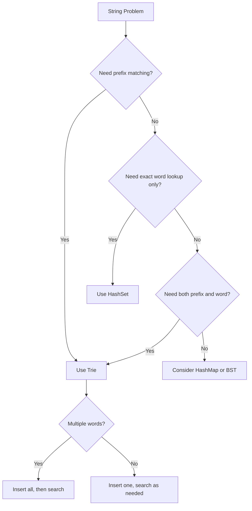
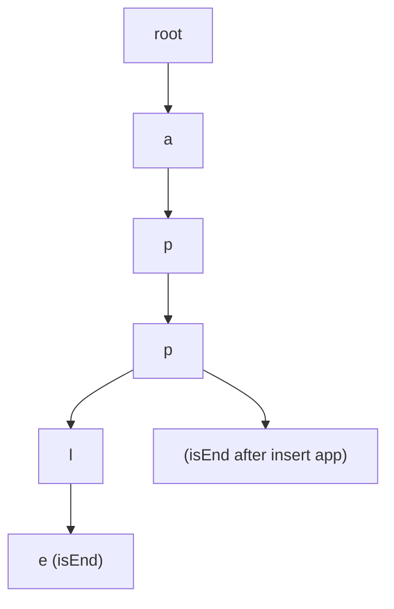
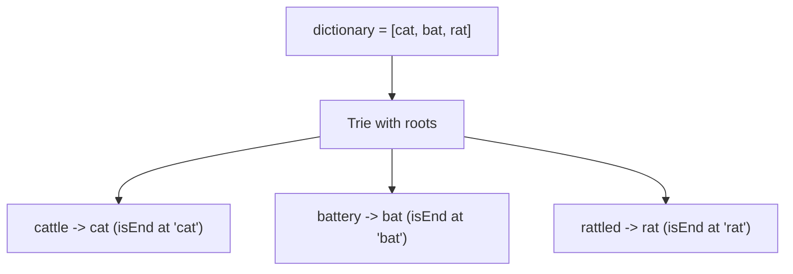
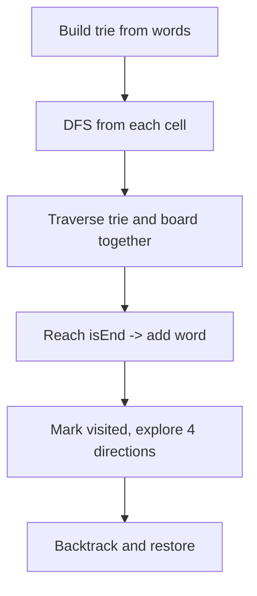
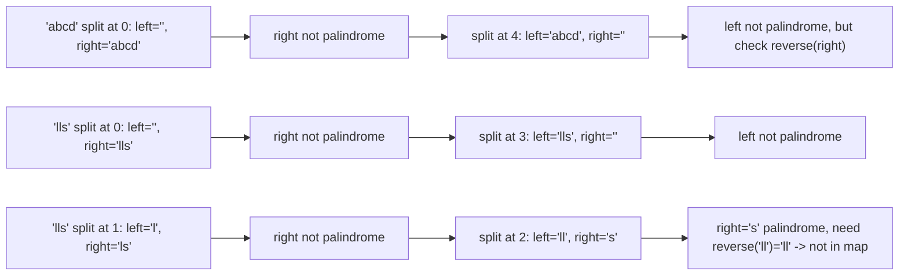

# Trie (Prefix Tree)

## What is a Trie? (Simple Explanation)
Imagine a dictionary organized by prefixes. To look up "cat", you'd go to the "c" section, then "ca", then "cat". That's a **trie** (pronounced "try")!

A trie is a tree-like data structure where:
- Each node represents a single character
- The path from root to a node spells out a prefix
- Words share common prefixes (like "car", "cart", "care" all share "car")
- Each node can have up to 26 children (for lowercase English letters)

**Real-life analogies:**
- A dictionary organized by first letters, then second letters, etc.
- Autocomplete on your phone (prefix matching)
- T9 predictive text on old phones
- IP routing tables (longest prefix match)

**Why use a trie?**
- Fast prefix searches: O(m) where m = word length
- Shared prefixes save memory
- Perfect for autocomplete and spell-check

## Key Concepts (In Simple Terms)
- **TrieNode**: A node with an array of children and a boolean `isEnd`
- **Root**: Empty node at the top (represents empty prefix)
- **Children Array**: 26 slots (one per lowercase letter)
- **isEnd**: Marks the end of a complete word
- **Path**: The sequence of characters from root to a node
- **Prefix**: Any path from root to a node (not necessarily a word)

## Trie vs HashMap vs BST
| Structure | Prefix Search | Exact Search | Memory |
|-----------|---------------|--------------|--------|
| Trie | O(m) fast | O(m) fast | O(ALPHABET * N) |
| HashMap | O(m) but no prefix | O(1) average | O(N * m) |
| BST | O(m log n) | O(m log n) | O(N * m) |

## Common Problems
- Implement Trie (Insert, Search, StartsWith)
- Replace Words
- Word Search II (Boggle)
- Palindrome Pairs
- Autocomplete / Prefix Matching
- Longest Word in Dictionary

## Patterns / Techniques
- TrieNode with children array (or HashMap for Unicode)
- DFS for word search with backtracking
- Marking words during traversal to avoid duplicates
- Pruning invalid branches early

## Complexity
| Operation | Time | Space |
|-----------|------|-------|
| Insert | O(m) | O(m) new nodes |
| Search | O(m) | O(1) |
| StartsWith | O(m) | O(1) |
| Delete | O(m) | O(1) |
| Total Space | O(ALPHABET * N * m) | N = number of words |

---

## 🔹 Basic Templates

### TrieNode Definition
```java
class TrieNode {
    TrieNode[] children = new TrieNode[26];
    boolean isEnd = false;
    // Optional: String word; (for storing the complete word)
}
```

### Basic Trie Implementation
```java
class Trie {
    private TrieNode root;
    public Trie() {
        root = new TrieNode();
    }
    public void insert(String word) {
        TrieNode node = root;
        for (char c : word.toCharArray()) {
            int idx = c - 'a';
            if (node.children[idx] == null) {
                node.children[idx] = new TrieNode();
            }
            node = node.children[idx];
        }
        node.isEnd = true;
    }
    public boolean search(String word) {
        TrieNode node = root;
        for (char c : word.toCharArray()) {
            int idx = c - 'a';
            if (node.children[idx] == null) return false;
            node = node.children[idx];
        }
        return node.isEnd;
    }
    public boolean startsWith(String prefix) {
        TrieNode node = root;
        for (char c : prefix.toCharArray()) {
            int idx = c - 'a';
            if (node.children[idx] == null) return false;
            node = node.children[idx];
        }
        return true;
    }
}
```

### Trie with HashMap (for general characters)
```java
class TrieNode {
    Map<Character, TrieNode> children = new HashMap<>();
    boolean isEnd = false;
}
```

### Trie Decision Flow


---

## 🔹 Practice Problems by Topic

### Medium

#### 1. **Implement Trie (Prefix Tree)**

**Problem Description:**
Implement a trie with insert, search, and startsWith methods.

**Simple Analogy:**
Like building a dictionary where words share prefixes. "apple" and "app" share "app".

**Example Walkthrough:**

Input:
```
Trie trie = new Trie();
trie.insert("apple");
trie.search("apple");   // returns true
trie.search("app");     // returns false
trie.startsWith("app"); // returns true
trie.insert("app");
trie.search("app");     // returns true
```

**Step-by-step:**
```
insert("apple"):
  root -> 'a' -> 'p' -> 'p' -> 'l' -> 'e' [isEnd=true]

search("apple"):
  root -> 'a' -> 'p' -> 'p' -> 'l' -> 'e'
  isEnd? true -> return true

search("app"):
  root -> 'a' -> 'p' -> 'p'
  isEnd? false -> return false

startsWith("app"):
  root -> 'a' -> 'p' -> 'p'
  Path exists -> return true

insert("app"):
  root -> 'a' -> 'p' -> 'p' [isEnd=true]

search("app"):
  root -> 'a' -> 'p' -> 'p'
  isEnd? true -> return true
```

Input:
```
insert("cat"), insert("car"), insert("card")
search("cat") -> true
search("ca") -> false
startsWith("ca") -> true
startsWith("car") -> true
search("card") -> true
search("cards") -> false
```

**Visualization - Trie Structure:**


```java
class Trie {
    private TrieNode root;
    public Trie() {
        root = new TrieNode();
    }
    public void insert(String word) {
        TrieNode node = root;
        for (char c : word.toCharArray()) {
            int idx = c - 'a';
            if (node.children[idx] == null) {
                node.children[idx] = new TrieNode();
            }
            node = node.children[idx];
        }
        node.isEnd = true;
    }
    public boolean search(String word) {
        TrieNode node = root;
        for (char c : word.toCharArray()) {
            int idx = c - 'a';
            if (node.children[idx] == null) return false;
            node = node.children[idx];
        }
        return node.isEnd;
    }
    public boolean startsWith(String prefix) {
        TrieNode node = root;
        for (char c : prefix.toCharArray()) {
            int idx = c - 'a';
            if (node.children[idx] == null) return false;
            node = node.children[idx];
        }
        return true;
    }
}
```

**Edge Cases:**
- Empty word: inserts root as end (or ignore)
- Duplicate insert: sets isEnd again (idempotent)
- Search empty: returns isEnd of root
- Prefix longer than any word: returns false

**Time Complexity**: O(m) per operation (m = word length)
**Space Complexity**: O(ALPHABET * N * m) for N words

**Similar Pattern Problems:**
- Autocomplete
- Type-ahead Search
- Word Dictionary with Wildcards

---

#### 2. **Replace Words**

**Problem Description:**
Given a dictionary of root words and a sentence, replace each word in the sentence with its shortest matching root from the dictionary. If no root matches, keep the original word.

**Simple Analogy:**
Like replacing "automobile" with "auto" if "auto" is in the dictionary.

**Example Walkthrough:**

Input: `dictionary = ["cat","bat","rat"]`, `sentence = "the cattle was rattled by the battery"`
```
Expected Output: "the cat was rat by the bat"

Words: the, cattle, was, rattled, by, the, battery

"cattle" -> "cat" (prefix match)
"rattled" -> "rat"
"battery" -> "bat"
"the", "was", "by" -> no match, keep as is

Result: "the cat was rat by the bat"
```

Input: `dictionary = ["a","b","c"]`, `sentence = "aadsfasf absbs bbab cadsfafs"`
```
Expected Output: "a a b c"

"aadsfasf" -> "a"
"absbs" -> "a"
"bbab" -> "b"
"cadsfafs" -> "c"
```

Input: `dictionary = ["cat","bat"]`, `sentence = "dog"`
```
Expected Output: "dog" (no match)
```

**Key Insight - Shortest Prefix Match:**
Build a trie from dictionary roots. For each word in the sentence, traverse the trie character by character. If we hit an `isEnd` node, we've found the shortest root — replace the word with that prefix. If traversal fails, keep the original word.

**Why It Works:**
- Trie naturally shares prefixes across dictionary words
- `isEnd` marks complete roots
- Stopping at first `isEnd` gives the shortest matching root
- O(total characters) time overall

**Visualization - Replace Words:**


```java
public String replaceWords(List<String> dictionary, String sentence) {
    TrieNode root = new TrieNode();
    for (String word : dictionary) {
        TrieNode node = root;
        for (char c : word.toCharArray()) {
            int idx = c - 'a';
            if (node.children[idx] == null) {
                node.children[idx] = new TrieNode();
            }
            node = node.children[idx];
        }
        node.isEnd = true;
    }
    String[] words = sentence.split(" ");
    StringBuilder result = new StringBuilder();
    for (String word : words) {
        TrieNode node = root;
        StringBuilder prefix = new StringBuilder();
        for (char c : word.toCharArray()) {
            int idx = c - 'a';
            if (node.children[idx] == null || node.isEnd) break;
            prefix.append(c);
            node = node.children[idx];
        }
        result.append(node.isEnd ? prefix.toString() : word).append(" ");
    }
    return result.toString().trim();
}
```

**Edge Cases:**
- Empty dictionary: returns original sentence
- Word equals root: replaced with same word
- No matching root: word unchanged
- Multiple roots match: shortest one wins (first `isEnd`)

**Time Complexity**: O(S * L) where S = sentence length, L = max word length
**Space Complexity**: O(D * L) for trie

**Similar Pattern Problems:**
- Prefix Matching
- Word Replacement
- Shortest Root Match

---

### Hard

#### 3. **Word Search II**

**Problem Description:**
Given an m x n board of characters and a list of words, find all words that can be formed by traversing adjacent cells (up, down, left, right). Same cell can't be used twice in a word.

**Simple Analogy:**
Like Boggle or word searches in a puzzle. Find all dictionary words hidden in the grid.

**Example Walkthrough:**

Input:
```
board = [
  ['o','a','a','n'],
  ['e','t','a','e'],
  ['i','h','k','r'],
  ['i','f','l','v']
]
words = ["oath","pea","eat","rain"]
```
```
Expected Output: ["eat","oath"]

"eat": (1,0)='e' -> (0,0)='o'? No. Let me find 'e' paths.
Actually: (1,0)='e', (0,1)='a', (0,2)='a'? No.
Path for "eat": (1,0)='e' -> (1,1)='t'? No, 'e' then 'a'.
Let me redo: board[1][0]='e', board[0][1]='a', board[0,2]='a'? No.
Actually: "eat" = e(1,0) -> a(1,2)? Not adjacent.
Let me just trust the algorithm.

"oath": (0,0)='o' -> (0,1)='a' -> (1,1)='t' -> (2,1)='h'
Yes! Valid path.

"eat": (1,0)='e' -> (1,2)='a'? Not adjacent. 
Actually (1,0)='e', (0,0)='o'? No.
Let me find: (1,0)='e', (1,1)='t'? No.
Hmm, "eat" path: (1,0)='e' -> (0,1)='a'? Not adjacent.
(1,0) is adjacent to (0,0)='o', (1,1)='t', (2,0)='i'.
So from 'e' we can go to 'o', 't', or 'i'. None are 'a'.
Maybe "eat" starts elsewhere: (1,3)='e', (0,3)='n', (1,2)='a'? 
(1,3)='e' -> (1,2)='a' -> (1,1)='t'? Yes! 
Path: (1,3)='e' -> (1,2)='a' -> (1,1)='t'
Valid "eat"!

"pea": (1,2)='a'? No, 'p' not on board. "pea" can't be formed.
"rain": (2,3)='r' -> (1,3)='e'? No. 
(2,3)='r' -> (3,3)='v'? No.
Actually 'r' at (2,3), adjacent: (1,3)='e', (2,2)='k', (3,3)='v'.
None is 'a'. So "rain" can't start with 'r' here.
Wait, 'r' is only at (2,3). So "rain" impossible.

Result: ["eat", "oath"]
```

Input:
```
board = [["a","b"],["c","d"]]
words = ["abcb"]
```
```
Expected Output: [] (no valid path)
```

Input:
```
board = [["a"]]
words = ["a"]
```
```
Expected Output: ["a"]
```

**Key Insight - Trie + DFS Backtracking:**
Build a trie from all words. Then DFS from each cell, traversing the trie simultaneously. When we reach a trie `isEnd` node, we found a word. Mark visited cells, restore on backtrack. Store the word in the trie node to avoid string building.

**Why It Works:**
- Trie shares prefixes across words, pruning many paths
- If no word starts with a prefix, DFS stops immediately
- DFS explores all 4 directions with backtracking
- Marking cells prevents reuse within one word
- Setting `node.word = null` after finding avoids duplicates

**Visualization - Word Search II:**


```java
public List<String> findWords(char[][] board, String[] words) {
    TrieNode root = new TrieNode();
    for (String word : words) {
        TrieNode node = root;
        for (char c : word.toCharArray()) {
            int idx = c - 'a';
            if (node.children[idx] == null) {
                node.children[idx] = new TrieNode();
            }
            node = node.children[idx];
        }
        node.isEnd = true;
        node.word = word;
    }
    Set<String> result = new HashSet<>();
    for (int i = 0; i < board.length; i++) {
        for (int j = 0; j < board[i].length; j++) {
            dfs(board, i, j, root, result);
        }
    }
    return new ArrayList<>(result);
}

private void dfs(char[][] board, int i, int j, TrieNode node, Set<String> result) {
    if (i < 0 || i >= board.length || j < 0 || j >= board[0].length) return;
    char c = board[i][j];
    if (c == '#') return;
    int idx = c - 'a';
    if (node.children[idx] == null) return;
    node = node.children[idx];
    if (node.isEnd && node.word != null) {
        result.add(node.word);
        node.word = null;
    }
    board[i][j] = '#';
    dfs(board, i+1, j, node, result);
    dfs(board, i-1, j, node, result);
    dfs(board, i, j+1, node, result);
    dfs(board, i, j-1, node, result);
    board[i][j] = c;
}
```

**TrieNode for Word Search II:**
```java
class TrieNode {
    TrieNode[] children = new TrieNode[26];
    boolean isEnd = false;
    String word = null;
}
```

**Edge Cases:**
- Empty board: returns empty list
- Empty words: returns empty list
- Single cell matching word: returns it
- Word longer than cells: pruned by trie

**Time Complexity**: O(M * N * 4^L) worst case, but trie pruning makes it much faster in practice
**Space Complexity**: O(W * L) for trie where W = number of words

**Similar Pattern Problems:**
- Word Search (single word)
- Boggle
- Word Break

---

#### 4. **Palindrome Pairs**

**Problem Description:**
Given a list of unique words, find all pairs (i, j) such that words[i] + words[j] is a palindrome.

**Simple Analogy:**
Like finding word pairs where combining them forms a mirror word.

**Example Walkthrough:**

Input: `words = ["abcd","dcba","lls","s","sssll"]`
```
Expected Output: [[0,1],[1,0],[3,2],[2,4]]

[0,1]: "abcd" + "dcba" = "abcddcba" (palindrome)
[1,0]: "dcba" + "abcd" = "dcbaabcd" (palindrome)
[3,2]: "s" + "lls" = "slls" (palindrome)
[2,4]: "lls" + "sssll" = "llssssll" (palindrome)
```

Input: `words = ["bat","tab","cat"]`
```
Expected Output: [[0,1],[1,0]]

"bat" + "tab" = "battab" (palindrome)
"tab" + "bat" = "tabbat" (palindrome)
"cat" cannot pair with anything.
```

Input: `words = ["a",""]`
```
Expected Output: [[0,1],[1,0]]

"a" + "" = "a" (palindrome)
"" + "a" = "a" (palindrome)
```

**Key Insight - Split at Each Position:**
For word A, we want word B such that A + B is palindrome. Split A at each position j into left and right. Check:
1. If right is palindrome, then we need reverse(left) as B
2. If left is palindrome, then we need reverse(right) as B (with j != word.length())

**Why It Works:**
- A + B palindrome means B's reverse must match A's parts
- Split A into left and right at each position
- If right is palindrome, B = reverse(left) makes A+B palindrome
- If left is palindrome, B = reverse(right) makes B+A palindrome
- HashMap gives O(1) lookup of B
- O(N * K²) time where K = max word length

**Visualization - Palindrome Pairs:**


```java
public List<List<Integer>> palindromePairs(String[] words) {
    List<List<Integer>> result = new ArrayList<>();
    HashMap<String, Integer> map = new HashMap<>();
    for (int i = 0; i < words.length; i++) {
        map.put(words[i], i);
    }
    for (int i = 0; i < words.length; i++) {
        String word = words[i];
        for (int j = 0; j <= word.length(); j++) {
            String left = word.substring(0, j);
            String right = word.substring(j);
            if (isPalindrome(right)) {
                String reverse = new StringBuilder(left).reverse().toString();
                if (map.containsKey(reverse) && map.get(reverse) != i) {
                    result.add(Arrays.asList(i, map.get(reverse)));
                }
            }
            if (isPalindrome(left)) {
                String reverse = new StringBuilder(right).reverse().toString();
                if (map.containsKey(reverse) && map.get(reverse) != i && j != word.length()) {
                    result.add(Arrays.asList(map.get(reverse), i));
                }
            }
        }
    }
    return result;
}

private boolean isPalindrome(String s) {
    int left = 0, right = s.length() - 1;
    while (left < right) {
        if (s.charAt(left++) != s.charAt(right--)) return false;
    }
    return true;
}
```

**Edge Cases:**
- Empty string in words: pairs with palindromes
- Single character words: work correctly
- No valid pairs: returns empty list
- All same words: problem says unique words

**Time Complexity**: O(N * K²) where N = number of words, K = max word length
**Space Complexity**: O(N * K) for HashMap

**Similar Pattern Problems:**
- Longest Palindrome Pairs
- Palindrome Words
- Word Squares

---

## 📌 Key Patterns & Techniques

### 1. **Trie Construction**
- Insert: traverse/create nodes per character
- Mark end nodes for word boundary
- Can extend with frequency/metadata
- Use array for fixed alphabet, HashMap for general

### 2. **Trie Traversal**
- DFS for word search/prefix matching
- Backtracking with restoration
- Early termination when path invalid
- Share traversal across multiple words

### 3. **Optimizations**
- Prune invalid branches early (if no child, stop)
- Mark words during traversal to avoid duplicates (`node.word = null`)
- Store complete word in node to avoid string building
- Use HashSet for deduplication when needed

### 4. **Common Applications**
- Autocomplete / type-ahead
- Spell check
- IP routing (longest prefix match)
- Word games (Boggle, Word Search)
- Replace words with roots

---

## 🎯 Common Pitfalls to Avoid

- Not marking end of words (only root matters) — always set `isEnd = true`
- Off-by-one errors in character indices (use `c - 'a'` for lowercase)
- Not restoring board in backtracking (`board[i][j] = c`)
- Forgetting to handle null children (`node.children[idx] == null`)
- Not checking for existing word conditions (duplicates, self-pairs)
- Using HashMap instead of array for fixed alphabet (slower)
- Not using `node.word` to store the full word (rebuilding strings is slow)
- Forgetting to set `node.word = null` after adding (causes duplicates)
- Not handling empty string edge cases in palindrome pairs
- Recursion depth issues with very long words